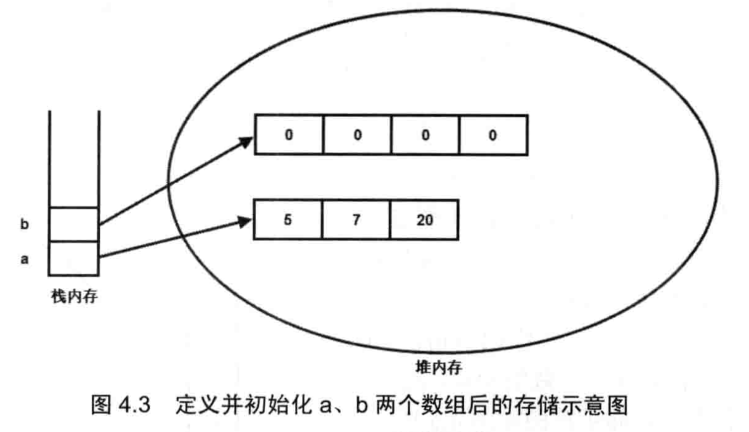
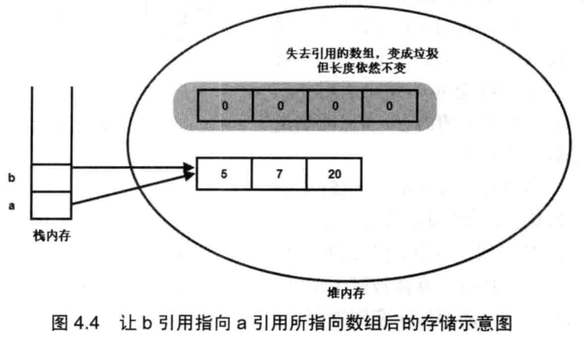

#T

##区域元素

------

在文章最上方输入---，按换行键产生，输入内容即可 

##标题

开头#的个数表示，空格+文字。标题有1~6个级别，#表示开始，按换行键结束 

```text
# H1
## h2
### h3
```

##引注

开头>表示，空格+文字，按换行键换行，双按换行跳出 

```text
> ni
>
> ni hao
```

##序列

开头*/+/-，空格+文字，可以创建无序序列，换行键换行，删除键+shift+tab跳出

开头1.，空格+后接文字，可以创建有序序列

```text
*   Red
+   Green
-   Blue

1.  Red
2.  Green
3.  Blue	
```

##可选序列

开头序列+空格+[ ]+空格+文字，换行键换行，删除键+shift+tab跳出 

```javascript
- [ ] a
+ [ ] b
* [ ] c
- [x] completed
```

- [ ] select
- [ ] select

##代码块

开头```+语言名，开启代码块，换行键换行，光标下移键跳出 

```javascript
this is daimakuai							
```

##数学块

使用MtathJax建立数学公式

开头$$+换行键，产生输入区域，输入Tex/LaTex格式的数学公式

```text
$$

$$	
```

$$
mathbf(10)/1
$$

##表格

开头|+列名+|+列名+|+换行键，创建一个2*2表格

将鼠标放置其上，弹出编辑尺寸，个数，文字等

```javascript
|列名|列名|
```


|name|password|
|||
||

##水平线

输入***/---，换行键换行 

------

```
***
```

------

```
---
```

##超链接

用[]括住要超链接的内容，紧接着用()括住超链接源+名字，超链接源后面+超链接命名 

```
This is [an example](http://example.com/ "Title") inline link.

[This link](http://example.net/) has no title attribute.
```

This is [an example](http://example.com/ "Title") inline link.

[This link](http://example.net/) has no title attribute.

##加粗

开头双*或双_，结尾双*或双_，建议双* 

```
**double asterisks**

__double underscores__**测试加粗**
```

##代码

```
Use the `printf()` function.
```

User the `printf()` function.

##高亮

需 `偏好设置` Panel -> `Markdown` Tab启动，

使用双==括住内容

==高亮==


#JS

###自定义分页

1.分页前后交互需要三个属性

+ ==List==           数据集合

+ ==pageNo==   当前所在的页数
+ ==pageSize==  每页的数据条数

2.代码解析

```javascript
<%@ page language="java" import="java.util.*" pageEncoding="UTF-8"%>
<!DOCTYPE html>
<html lang="zh">
<head>
<meta charset="utf-8">
<meta name="viewport" content="width=device-width, initial-scale=1">
<meta http-equiv="X-UA-Compatible" content="IE=Edge chrome=1">
<%@ taglib prefix="fn" uri="http://java.sun.com/jsp/jstl/functions" %>
<script type="text/javascript">
function page(pageNo){
	$("#pageNo").val(pageNo);
	$("#pageForm").submit();
}
// 	
function pageSkip() {
	var index = $("#pageText").val();
    if (index == "") {
        alert("请输入跳转的页面数！");
        return;
    }
	if(isNaN(index)) {
		alert("跳转页面必须为数值型");
		return;
	}
	if(index == 0){
    	index = 1;
    }
    if (index > ${pagination.totalPage})
   	{
    	$("#pageNo").val("" + ${pagination.totalPage});
   	}else{
   		$("#pageNo").val(""+index);
   	}
    $("#pageForm").submit();
}

function checkInput() {
    if (event.keyCode == 13) {
        page($("#pageText").val());
        return;
    }
	if ( (event.keyCode >= 48 && event.keyCode <= 57) || (event.keyCode >= 96 && event.keyCode <= 105) ||
     event.keyCode == 8 || event.keyCode == 37 || event.keyCode == 39 || event.keyCode == 127) {    
		
	 }else{
		 $("#pageText").val("");
	 }
}
//改变页面条数
function changePage(){
	$("#pageNo").val(1);
	$("#pageForm").submit();
}
</script>
</head>	
  <input type="hidden" name="pageNo" value="${pagination.pageNo}" id="pageNo">
  <div class="list-page clearfix">
     <div class="page-select">当前显示
         <select id="pageNumber" onchange="changePage()" name="pageSize">
             <option value="10" ${pagination.pageSize eq '10'?'selected':'' }>10</option>
             <option value="20" ${pagination.pageSize eq '20'?'selected':'' }>20</option>
             <option value="30" ${pagination.pageSize eq '30'?'selected':'' }>30</option>
             <option value="50" ${pagination.pageSize eq '50'?'selected':'' }>50</option>
         </select>条
     </div>
     <div class="page">
        <ul>                                                                                     
            <c:choose>
               <c:when test="${pagination.pageNo eq 1}">
                  <li  class="item prev disabled"><a>首页</a></li>   
                  <li class="item prev disabled"><a>上一页</a></li>		
		       </c:when>
			   <c:otherwise>
				  <li  class="item prev"><a onclick="page(1)">首页</a></li>
				  <li class="item prev"><a onclick="page(${pagination.pageNo-1})">上一页</a></li>
			   </c:otherwise>
		   </c:choose>
           <c:forEach var="page" begin="${fn:substringBefore(((pagination.pageNo-1)/5),'.')*5+1}" end="${((fn:substringBefore((pagination.pageNo-1)/5,'.')+1)*5) >= pagination.totalPage ? pagination.totalPage : ((fn:substringBefore((pageNo-1)/5,'.')+1)*5)}">
			    <li ${pageNo eq page?'class="item on"':''}><a href="javascript:void(0)" onclick="page(${page})">${page}</a></li> &nbsp;  
		   </c:forEach>
           <c:choose>
             <c:when test="${pagination.pageNo eq pagination.totalPage}">
			 <li class="item next disabled"><a>下一页</a></li>
			 <li class="item next disabled"><a>尾页</a></li>
		   </c:when>
		   <c:otherwise>
			 <li class="item next"><a onclick="page(${pagination.pageNo+1})">下一页</a></li>
			 <li class="item next"><a onclick="page(${pagination.totalPage})">尾页</a></li>
		   </c:otherwise>
          </c:choose>
           <li><span class="count-log">共有<c:out value="${pagination.totalCount}"/>条记录</li>
           <li>共<c:out value="${pagination.totalPage}" />页&nbsp;</li>
           <li class="page-input">到<input type="number"  value="${pagination.pageNo gt 0?pagination.pageNo:''}" onkeyup="checkInput();" id="pageText" class="form-control input-sm"  min="1" max="${pagination.totalPage}" aria-label="页码输入框" />页</li>
           <li class="page-ship"><button onclick="pageSkip();">确定</button></li>
       </ul>
    </div>
</div>
</html>
```

###扩展我们需要的功能

```javascript
$.extend({ 
    min: function(a, b){return a < b?a:b; },
    max: function(a, b){return a > b?a:b; }
}); //为jquery扩展了min,max两个方法
```

使用扩展的方法（通过“$.方法名”调用）：	

```javascript
alert("a=10,b=20,max="+$.max(10,20)+",min="+$.min(10,20));
```

###操作元素的样式

主要包括以下几种方式：

```javascript
$("#msg").css("background"); //返回元素的背景颜色
$("#msg").css("background","#ccc") //设定元素背景为灰色
$("#msg").height(300); $("#msg").width("200"); //设定宽高
$("#msg").css({ color: "red", background: "blue" });//以名值对的形式设定样式
$("#msg").addClass("select"); //为元素增加名称为select的class
$("#msg").removeClass("select"); //删除元素名称为select的class
$("#msg").toggleClass("select"); //如果存在（不存在）就删除（添加）名称为select的class
```

###完善的事件处理功能 

Jquery已经为我们提供了各种事件处理方法，我们无需在html元素上直接写事件，而可以直接为通过jquery获取的对象添加事件。

如： 

```
$("#msg").click(function(){alert("good")}) //为元素添加了单击事件
$("p").click(function(i){this.style.color=['#f00','#0f0','#00f'][i]})
//为三个不同的p元素单击事件分别设定不同的处理
```

jQuery中几个自定义的事件：

（1）hover(fn1,fn2)：一个模仿悬停事件（鼠标移动到一个对象上面及移出这个对象）的方法。当鼠标移动到一个匹配的元素上面时，会触发指定的第一个函数。当鼠标移出这个元素时，会触发指定的第二个函数。

//当鼠标放在表格的某行上时将class置为over，离开时置为out。

```javascript
$("tr").hover(
function(){
     $(this).addClass("over");
}, 
function(){ 
$(this).addClass("out"); 
});
```

（2）ready(fn):当DOM载入就绪可以查询及操纵时绑定一个要执行的函数。 

$(document).ready(function(){alert("Load Success")})<http://www.idaima.com/a/1663.html> 

//页面加载完毕提示“Load Success”,不同于onload事件，onload需要页面内容加载完毕（图片等），而ready只要页面html代码下载完毕即触发。与$(fn)等价 

（3）toggle(evenFn,oddFn): 每次点击时切换要调用的函数。如果点击了一个匹配的元素，则触发指定的第一个函数，当再次点击同一元素时，则触发指定的第二个函数。随后的每次点击都重复对这两个函数的轮番调用。 

```javascript
//每次点击时轮换添加和删除名为selected的class。
$("p").toggle(function(){ 
     $(this).addClass("selected"); 
},function(){ 
     $(this).removeClass("selected"); 
});
```

（4）trigger(eventtype): 在每一个匹配的元素上触发某类事件。

例如：

$("p").trigger("click"); //触发所有p元素的click事件

（5）bind(eventtype,fn)，unbind(eventtype): 事件的绑定与反绑定

从每一个匹配的元素中（添加）删除绑定的事件。 

例如： 

$("p").bind("click", function(){alert($(this).text());}); //为每个p元素添加单击事件 

$("p").==unbind()==; //删除所有p元素上的所有事件 

$("p").==unbind("click")== //删除所有p元素上的单击事件

###jQuery实现回车监听

复制

```javascript
$("#password").keydown(function(e) {
    if (e && e.keyCode == 13) {
        login();
    }
});
```

JS数组方法

**JavaScript中创建数组有两种方式**

**（一）使用 Array 构造函数：**

```
var arr1 = new Array(); //创建一个空数组
var arr2 = new Array(20); // 创建一个包含20项的数组
var arr3 = new Array("lily","lucy","Tom"); // 创建一个包含3个字符串的数组
```

**（二）使用数组字面量表示法：**

```
var arr4 = []; //创建一个空数组
var arr5 = [20]; // 创建一个包含1项的数组
var arr6 = ["lily","lucy","Tom"]; // 创建一个包含3个字符串的数组
```

数组的方法有数组原型方法，也有从object对象继承来的方法，这里我们只介绍数组的原型方法，数组原型方法主要有以下这些：

join()
push()和pop()
shift() 和 unshift()
sort()
reverse()
concat()
slice()
splice()
indexOf()和 lastIndexOf() （ES5新增）
forEach() （ES5新增）
map() （ES5新增）
filter() （ES5新增）
every() （ES5新增）
some() （ES5新增）
reduce()和 reduceRight() （ES5新增）

下面详细介绍一下各个方法的基本功能。

**1、join()**

join(separator): 将数组的元素组起一个字符串，以separator为分隔符，省略的话则用默认用逗号为分隔符，该方法只接收一个参数：即分隔符。

```javascript
var arr = [1,2,3];
console.log(arr.join()); // 1,2,3
console.log(arr.join("-")); // 1-2-3
console.log(arr); // [1, 2, 3]（原数组不变）
```

通过join()方法可以实现重复字符串，只需传入字符串以及重复的次数，就能返回重复后的字符串，函数如下：

```javascript
function repeatString(str, n) {
return new Array(n + 1).join(str);
}
console.log(repeatString("abc", 3)); // abcabcabc
console.log(repeatString("Hi", 5)); // HiHiHiHiHi
```

**2、push()和pop()**

push(): 可以接收任意数量的参数，把它们逐个添加到数组末尾，并返回修改后数组的长度。 
pop()：数组末尾移除最后一项，减少数组的 length 值，然后返回移除的项。

```javascript

var arr = ["Lily","lucy","Tom"];
var count = arr.push("Jack","Sean");
console.log(count); // 5
console.log(arr); // ["Lily", "lucy", "Tom", "Jack", "Sean"]
var item = arr.pop();
console.log(item); // Sean
console.log(arr); // ["Lily", "lucy", "Tom", "Jack"]

```

**3、shift() 和 unshift()**

shift()：删除原数组第一项，并返回删除元素的值；如果数组为空则返回undefined 。 
unshift:将参数添加到原数组开头，并返回数组的长度 。

这组方法和上面的push()和pop()方法正好对应，一个是操作数组的开头，一个是操作数组的结尾。

```javascript

var arr = ["Lily","lucy","Tom"];
var count = arr.unshift("Jack","Sean");
console.log(count); // 5
console.log(arr); //["Jack", "Sean", "Lily", "lucy", "Tom"]
var item = arr.shift();
console.log(item); // Jack
console.log(arr); // ["Sean", "Lily", "lucy", "Tom"]

```

**4、sort()**

sort()：按升序排列数组项——即最小的值位于最前面，最大的值排在最后面。

在排序时，sort()方法会调用每个数组项的 toString()转型方法，然后比较得到的字符串，以确定如何排序。即使数组中的每一项都是数值， sort()方法比较的也是字符串，因此会出现以下的这种情况：

```javascript

var arr1 = ["a", "d", "c", "b"];
console.log(arr1.sort()); // ["a", "b", "c", "d"]
arr2 = [13, 24, 51, 3];
console.log(arr2.sort()); // [13, 24, 3, 51]
console.log(arr2); // [13, 24, 3, 51](元数组被改变)
```

为了解决上述问题，sort()方法可以接收一个比较函数作为参数，以便我们指定哪个值位于哪个值的前面。比较函数接收两个参数，如果第一个参数应该位于第二个之前则返回一个负数，如果两个参数相等则返回  0，如果第一个参数应该位于第二个之后则返回一个正数。以下就是一个简单的比较函数：

```javascript
function compare(value1, value2) {
if (value1 < value2) {
return -1;
} else if (value1 > value2) {
return 1;
} else {
return 0;
}
}
arr2 = [13, 24, 51, 3];
console.log(arr2.sort(compare)); // [3, 13, 24, 51]
```

如果需要通过比较函数产生降序排序的结果，只要交换比较函数返回的值即可：

```javascript
function compare(value1, value2) {
if (value1 < value2) {
return 1;
} else if (value1 > value2) {
return -1;
} else {
return 0;
}
}
arr2 = [13, 24, 51, 3];
console.log(arr2.sort(compare)); // [51, 24, 13, 3]
```

**5、reverse()**

reverse()：反转数组项的顺序。

```javascript
var arr = [13, 24, 51, 3];
console.log(arr.reverse()); //[3, 51, 24, 13]
console.log(arr); //[3, 51, 24, 13](原数组改变)
```

**6、concat()**

concat() ：将参数添加到原数组中。这个方法会先创建当前数组一个副本，然后将接收到的参数添加到这个副本的末尾，最后返回新构建的数组。在没有给 concat()方法传递参数的情况下，它只是复制当前数组并返回副本。

```javascript
var arr = [1,3,5,7];
var arrCopy = arr.concat(9,[11,13]);
console.log(arrCopy); //[1, 3, 5, 7, 9, 11, 13]
console.log(arr); // [1, 3, 5, 7](原数组未被修改)
```

从上面测试结果可以发现：传入的不是数组，则直接把参数添加到数组后面，如果传入的是数组，则将数组中的各个项添加到数组中。但是如果传入的是一个二维数组呢？

```javascript
var arrCopy2 = arr.concat([9,[11,13]]);
console.log(arrCopy2); //[1, 3, 5, 7, 9, Array[2]]
console.log(arrCopy2[5]); //[11, 13]
```

上述代码中，arrCopy2数组的第五项是一个包含两项的数组，也就是说concat方法只能将传入数组中的每一项添加到数组中，如果传入数组中有些项是数组，那么也会把这一数组项当作一项添加到arrCopy2中。

**7、slice()**

slice()：返回从原数组中指定开始下标到结束下标之间的项组成的新数组。slice()方法可以接受一或两个参数，即要返回项的起始和结束位置。在只有一个参数的情况下，  slice()方法返回从该参数指定位置开始到当前数组末尾的所有项。如果有两个参数，该方法返回起始和结束位置之间的项——但不包括结束位置的项。

```javascript
var arr = [1,3,5,7,9,11];
var arrCopy = arr.slice(1);
var arrCopy2 = arr.slice(1,4);
var arrCopy3 = arr.slice(1,-2);
var arrCopy4 = arr.slice(-4,-1);
console.log(arr); //[1, 3, 5, 7, 9, 11](原数组没变)
console.log(arrCopy); //[3, 5, 7, 9, 11]
console.log(arrCopy2); //[3, 5, 7]
console.log(arrCopy3); //[3, 5, 7]
console.log(arrCopy4); //[5, 7, 9]
```

arrCopy只设置了一个参数，也就是起始下标为1，所以返回的数组为下标1（包括下标1）开始到数组最后。 
arrCopy2设置了两个参数，返回起始下标（包括1）开始到终止下标（不包括4）的子数组。 
arrCopy3设置了两个参数，终止下标为负数，当出现负数时，将负数加上数组长度的值（6）来替换该位置的数，因此就是从1开始到4（不包括）的子数组。 
arrCopy4中两个参数都是负数，所以都加上数组长度6转换成正数，因此相当于slice(2,5)。

**8、splice()**

splice()：很强大的数组方法，它有很多种用法，可以实现删除、插入和替换。

删除：可以删除任意数量的项，只需指定 2 个参数：要删除的第一项的位置和要删除的项数。例如， splice(0,2)会删除数组中的前两项。

插入：可以向指定位置插入任意数量的项，只需提供 3 个参数：起始位置、 0（要删除的项数）和要插入的项。例如，splice(2,0,4,6)会从当前数组的位置 2 开始插入4和6。
替换：可以向指定位置插入任意数量的项，且同时删除任意数量的项，只需指定  3 个参数：起始位置、要删除的项数和要插入的任意数量的项。插入的项数不必与删除的项数相等。例如，splice  (2,1,4,6)会删除当前数组位置 2 的项，然后再从位置 2 开始插入4和6。

splice()方法始终都会返回一个数组，该数组中包含从原始数组中删除的项，如果没有删除任何项，则返回一个空数组。

```javascript
var arr = [1,3,5,7,9,11];
var arrRemoved = arr.splice(0,2);
console.log(arr); //[5, 7, 9, 11]
console.log(arrRemoved); //[1, 3]
var arrRemoved2 = arr.splice(2,0,4,6);
console.log(arr); // [5, 7, 4, 6, 9, 11]
console.log(arrRemoved2); // []
var arrRemoved3 = arr.splice(1,1,2,4);
console.log(arr); // [5, 2, 4, 4, 6, 9, 11]
console.log(arrRemoved3); //[7]
```

**9、indexOf()和 lastIndexOf()**

indexOf()：接收两个参数：要查找的项和（可选的）表示查找起点位置的索引。其中， 从数组的开头（位置 0）开始向后查找。 
lastIndexOf：接收两个参数：要查找的项和（可选的）表示查找起点位置的索引。其中， 从数组的末尾开始向前查找。

这两个方法都返回要查找的项在数组中的位置，或者在没找到的情况下返回1。在比较第一个参数与数组中的每一项时，会使用全等操作符。

```javascript
var arr = [1,3,5,7,7,5,3,1];
console.log(arr.indexOf(5)); //2
console.log(arr.lastIndexOf(5)); //5
console.log(arr.indexOf(5,2)); //2
console.log(arr.lastIndexOf(5,4)); //2
console.log(arr.indexOf("5")); //-1
```

**10、forEach()**

forEach()：对数组进行遍历循环，对数组中的每一项运行给定函数。这个方法没有返回值。参数都是function类型，默认有传参，参数分别为：遍历的数组内容；第对应的数组索引，数组本身。

```javascript
var arr = [1, 2, 3, 4, 5];
arr.forEach(function(x, index, a){
console.log(x + '|' + index + '|' + (a === arr));
});
// 输出为：
// 1|0|true
// 2|1|true
// 3|2|true
// 4|3|true
// 5|4|true
```

**11、map()**

map()：指“映射”，对数组中的每一项运行给定函数，返回每次函数调用的结果组成的数组。

下面代码利用map方法实现数组中每个数求平方。

```javascript
var arr = [1, 2, 3, 4, 5];
var arr2 = arr.map(function(item){
return item*item;
});
console.log(arr2); //[1, 4, 9, 16, 25]
```

**12、filter()**

filter()：“过滤”功能，数组中的每一项运行给定函数，返回满足过滤条件组成的数组。

**13、every()**

every()：判断数组中每一项都是否满足条件，只有所有项都满足条件，才会返回true。

**14、some()**

some()：判断数组中是否存在满足条件的项，只要有一项满足条件，就会返回true。

**15、reduce()和 reduceRight()**

这两个方法都会实现迭代数组的所有项，然后构建一个最终返回的值。reduce()方法从数组的第一项开始，逐个遍历到最后。而 reduceRight()则从数组的最后一项开始，向前遍历到第一项。

这两个方法都接收两个参数：一个在每一项上调用的函数和（可选的）作为归并基础的初始值。

传给 reduce()和 reduceRight()的函数接收 4  个参数：前一个值、当前值、项的索引和数组对象。这个函数返回的任何值都会作为第一个参数自动传给下一项。第一次迭代发生在数组的第二项上，因此第一个参数是数组的第一项，第二个参数就是数组的第二项。

下面代码用reduce()实现数组求和，数组一开始加了一个初始值10。


# JSP

```javascript
01、onabort： 当用户终止正在打开的网页时产生该事件。
02、onblur： 某元素失去活动焦点时产生该事件。例如鼠标在文本框中点击后又在文本框外点击时就会产生。
03、onchange： 当网页上某元素的内容发生改变时产生。例如在文本框中输入文本后又在文本框外点击时就会产生。
04、onclick： 单击网页上的某元素时产生
05、ondblclick： 双击网页上的元素时产生
06、onerror： 浏览器在打开网页的过程中发生错误时产生该事件
07、onfinish： 滚动文本条中的文本完成一次滚动时产生的事件
08、onfocus： 网页上的元素获得焦点时产生该事件
09、onkeydown：  按下任意键时产生该事件
10、onkeypress： 按下任意键时并释放该键产生的事件
11、onkeyup： 释放按下的按键产生该事件
12、onload： 网页或图象调入完成后产生该事件
13、onmousedown： 在网页的某元素上按下鼠标时产生该事件
14、onmousemove： 在网页的某元素上移动鼠标时产生该事件
15、onmouseout： 从网页的某元素移出鼠标时产生该事件
16、onmouseover： 鼠标移入网页的某元素时产生该事件
17、onmouseup： 释放按下的鼠标时产生该事件
18、onreset： 复位表格时产生该事件
19、onresize： 改变浏览器时产生该事件
20、onselect： 选择文本框中的文本时产生该事件
21、onstart： 滚动文本条中的文本开始滚动时产生该事件
22、onsubmit： 提交表单时产生该事件
23、onunload： 从当前的网页退出时产生该事件
```

##鼠标悬停变小手
```css
style="cursor:pointer;"
```

##Input输入框
```iavascript
数量 ( 1 到 5 之间): <input type="number" name="quantity" min="1" max="5">
```

##iframe高度自适应
```javascript
<iframe src="" name="ifd" onload="this.height=ifd.document.body.scrollHeight" width="100%" scrolling="no" frameborder="0"></iframe>
```

##jsp父子页面互调
```
windows.parent().父类方法
```

##页面限制时间显示格式
```javascript
<fmt:formatDate value="${list.createDt }" pattern="yyyy-MM-dd HH:mm"/>
```

##自定义标签
<tzx>Tzx<tzx>

```
$("tzx").click(function () {
             $(this).next().remove();
        });
<tzx>tzx</tzx>
```


# JAVA

##集合概述
java集合大致可以分为Set、List、Queue()、Map。

+ Set：代表的是无序、不可重复的集合，它只把数据本身存进去，访问的时候也只能本身来访问（这也是set不能重复的原因）。
+ List：代表有序的、重复的集合，存数据时分配一个索引，访问时根据索引访问。
+ Map：代表具有映射关系的集合，存key和value，访问时通过key访问。相当于索引和值都是我们来规定。
+ Queue：代表队列集合。

##栈和堆

假如，当程序初始化两个对象时，系统内存在其实产生了四块内存区，其中栈内存中有两块引用变量（变量的引用），堆中也有两块内存区（变量本身）。如图：



当我们执行了代码 b=a时，系统会把a的值赋给b，而a和b都是变量的引用，储存的是实际变量的地址。所以a是把地址赋给了b。



由图可知，当b的指向地址改变之后，原地址的变量就失去了作用，变成了垃圾，只有等待垃圾回收机制来回收它（在彻底消失前，变量的长度不变）

##JSON

ajxa发送JSON数组的data，controller用@RequestBody 接收。

```javascript
function upData(treeNodes){
	$.ajax({
		type:"post",
		url:"/abTest/upData",
		data:JSON.stringify(treeNodes),
		dataType:"text",
		contentType: "application/json",
		success:function(data){
			alert(data);
		},
		error:function(){
			alert("error");
		}
	});
}
<--==========================================->
	@ResponseBody
	@RequestMapping(value="/abTest/upData")
	public String upData(@RequestBody JSONObject[] treeNodes){
		String name="";
		if(treeNodes!=null && treeNodes.length>0){
			for(JSONObject jObject:treeNodes){
				name=jObject.getString("name");
			}
		}
		return name;
	}
```

## HashjMap

```js
https://yikun.github.io/2015/04/01/Java-HashMap%E5%B7%A5%E4%BD%9C%E5%8E%9F%E7%90%86%E5%8F%8A%E5%AE%9E%E7%8E%B0/
```


# Mybatis

##Mybatis传入参数类型为Map

参考：

https://www.cnblogs.com/seeusmile-cnblog/p/6221340.html

https://www.cnblogs.com/huzi007/p/5969711.html

方式一：

mybatis更新sql语句：

```xml
<update id="publishT00_notice" parameterType="Map">
update test  
set createdate = #{createdate},
creator = #{creator}
where id in 
<foreach collection="ids" item="ids" separator="," open="(" close=")">
#{ids}
</foreach>
</update>
```

传入map参数类型：

```xml
    HashMap<String,Object> map = new HashMap<String, Object>();
    map.put("creator", "creator");
    map.put("createdate", "createdate");
     
    String[] ids = {"1","2"};
    map.put("ids", ids );
```

方式二：

第一步在你的mapper写上:

```xml
 List<WeixinUserLocationList> findweixinUserLocations(@Param("params") Map<String, Object> map);
```

注意就是注解@param 这个，是mybatis的

然后在xml中这样写:

```xml
<if test="params.accountId!=null">
            and a.accountid=#{params.accountId}
        </if>
        <if test="params.nickname!=null and params.nickname !=''">
            and a.nickname like '%${params.nickname}%'
        </if>
        <if test="params.beginDate!=null and params.beginDate!=''">
            and date_format(a.createtime,'%Y-%m-%d')>=${params.beginDate}
        </if>
        <if test="params.endDate!=null and params.endDate!=''">
        <![CDATA[    and date_format(a.createtime,'%Y-%m-%d')<=${params.endDate}  ]]>     
        </if>
```

 ## Mybatis传参查询为null

```javascript
// 当xml中sq没问题时，传回来的数据为null，可能是因为编码的问题 只需要在url上加上一下代码
?autoReconnect=true&useUnicode=true&characterEncoding=utf8
```

# SpringBoot

```xml
<?xml version="1.0" encoding="UTF-8"?>
<project xmlns="http://maven.apache.org/POM/4.0.0" xmlns:xsi="http://www.w3.org/2001/XMLSchema-instance"
	xsi:schemaLocation="http://maven.apache.org/POM/4.0.0 http://maven.apache.org/xsd/maven-4.0.0.xsd">
	<modelVersion>4.0.0</modelVersion>

	<groupId>com.tor</groupId>
	<artifactId>demo</artifactId>
	<version>0.0.1-SNAPSHOT</version>
	<packaging>war</packaging>

	<name>demo</name>
	<description>Demo project for Spring Boot</description>

	<parent>
		<groupId>org.springframework.boot</groupId>
		<artifactId>spring-boot-starter-parent</artifactId>
		<version>2.0.5.BUILD-SNAPSHOT</version>
		<relativePath/> <!-- lookup parent from repository -->
	</parent>

	<properties>
		<project.build.sourceEncoding>UTF-8</project.build.sourceEncoding>
		<project.reporting.outputEncoding>UTF-8</project.reporting.outputEncoding>
		<java.version>1.8</java.version>
	</properties>

	<dependencies>
		<dependency>
			<groupId>org.springframework.boot</groupId>
			<artifactId>spring-boot-starter-web</artifactId>
		</dependency>

		<dependency>
			<groupId>org.springframework.boot</groupId>
			<artifactId>spring-boot-starter-tomcat</artifactId>
		</dependency>
		<dependency>
			<groupId>org.springframework.boot</groupId>
			<artifactId>spring-boot-starter-test</artifactId>
			<scope>test</scope>
		</dependency>
		<!--以下两个是支持jsp 好像打包还要位war-->
		<dependency>
			<groupId>javax.servlet</groupId>
			<artifactId>jstl</artifactId>
			<version>1.2</version>
		</dependency>
		<dependency>
			<groupId>org.apache.tomcat.embed</groupId>
			<artifactId>tomcat-embed-jasper</artifactId>
			<!--<scope>provided</scope>-->
		</dependency>
	</dependencies>

	<build>
		<plugins>
			<plugin>
				<groupId>org.springframework.boot</groupId>
				<artifactId>spring-boot-maven-plugin</artifactId>
			</plugin>
		</plugins>
	</build>

	<repositories>
		<repository>
			<id>spring-snapshots</id>
			<name>Spring Snapshots</name>
			<url>https://repo.spring.io/snapshot</url>
			<snapshots>
				<enabled>true</enabled>
			</snapshots>
		</repository>
		<repository>
			<id>spring-milestones</id>
			<name>Spring Milestones</name>
			<url>https://repo.spring.io/milestone</url>
			<snapshots>
				<enabled>false</enabled>
			</snapshots>
		</repository>
	</repositories>

	<pluginRepositories>
		<pluginRepository>
			<id>spring-snapshots</id>
			<name>Spring Snapshots</name>
			<url>https://repo.spring.io/snapshot</url>
			<snapshots>
				<enabled>true</enabled>
			</snapshots>
		</pluginRepository>
		<pluginRepository>
			<id>spring-milestones</id>
			<name>Spring Milestones</name>
			<url>https://repo.spring.io/milestone</url>
			<snapshots>
				<enabled>false</enabled>
			</snapshots>
		</pluginRepository>
	</pluginRepositories>


</project>
```

##IDEA创建的springboot项目没有web.xml文件

- 只需要在facets里增加web.xml


## git pull代码到本地

```
在项目的根目录，右键GIT BASH,输入 git pull命令
```

##springboot支持jsp

```xml
spring.mvc.view.prefix= /WEB-INF/views/
spring.mvc.view.suffix=.jsp
```

##IDEA管理github

```
https://www.cnblogs.com/buwuliao/p/8759240.html
```

##IDEA中根据表生产实体类（基于hibernate） 

```
 https://blog.csdn.net/tianyaleixiaowu/article/details/78204453
```

##IDEA使用上传项目到GitHub 

```
 https://blog.csdn.net/han_xiaoxue/article/details/79088959
```

## IDEA快捷键转化成Eclipse风格 

```
 https://blog.csdn.net/AinUser/article/details/67631561
```
###IDEA下SpringBoot实现热部署

```
https://blog.csdn.net/yuanlaijike/article/details/81324225
```

## IDEA单窗口多项目

```
https://blog.csdn.net/sun_shaoping/article/details/68927466
```

## 域名替代ip地址

```html
  在游览器输入域名访问时，会先到hosts文件查看是否有对应的指定ip，
  因为我们是通过ip访问的，如果本地的hosts没有匹配的域名，则会到远程DNS找对应的ip，再返回相应的ip地址，游览器再根据ip访问。
  如果需要用域名替换ip，只需要在本地的hosts文件中指定即可。
  如 127.0.0.1  www.test.com
```

 [hosts文件地址](C:\Windows\System32\drivers\etc) 

## 把spring-boot项目部署到tomcat容器中

```
https://www.cnblogs.com/a8457013/p/7687820.html
```

如果命令行打包出错，参考这篇文章 [Maven常见异常及解决方法](https://blog.csdn.net/lch_cn/article/details/8225448/)

## IDEA启动把web部署到tomcat的webapps下

```
https://blog.csdn.net/kingolie/article/details/79763620
```


