# Linux

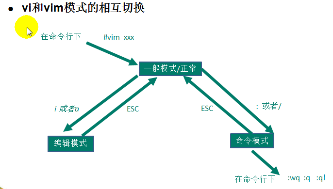

一 、 基本命令指令

```
cd : 切换目录
mkdir ： 创建目录
tar -zxvf： 解压 .gz格式的压缩包
unzip : 解压 .zip格式的压缩包
ps -ef|grep java 查看tomcat是否开启
reboot linux重启系统
```

##Linux上安装jdk1.8

```
https://www.cnblogs.com/shihaiming/p/5809553.html
```

## mini版本安装图形界面

```
yum -y groupinstall "GNOME Desktop" 
```

## 没有防火墙指令

```
https://www.cnblogs.com/AmbitiousMice/p/8486049.html
```

# centos7开启防火墙端口

```
https://blog.csdn.net/fuck487/article/details/78621999
```

## 查看tomcat进程启动

```
ps -ef|grep java
```

# 安装mysql

```
https://blog.csdn.net/zhichaosong/article/details/80945018
```

## 查看tomcat的logs日志

```
tail -f catalina.out
```

##修改linux下mysql的密码

本例中以CentOS6.6下修改MySQL5.1.73举例说明。

1.首先输入“service mysqld status”查看当前mysql服务状态，下图显示正在mysqld服务正在运行中。

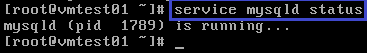

2.输入“killall -TERM mysqld”命令停止所有的mysqld进程。

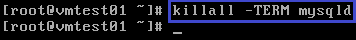

3.输入“service mysqld stop”命令停止mysqld服务。

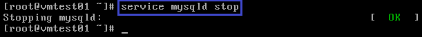

4.输入“mysqld_safe  --skip-grant-tables &”命令以无密码方式进入MySQL安全模式。

[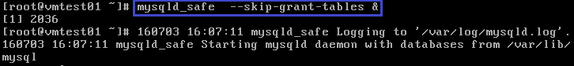](https://files.jb51.net/file_images/article/201703/2017031709023822.png)

5.输入“mysql -u root”并按回车键即可。

[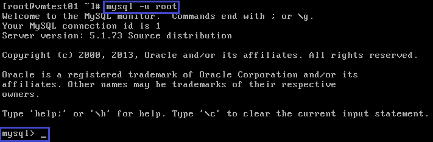](https://files.jb51.net/file_images/article/201703/2017031709023923.png)

6.输入“use mysql;”挂载数据库。

注意：请勿忘记在最后输入分号（;）。

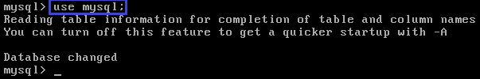

7.输入"update user set password=password("New9ssw0rd") where user='root';"将Root密码修改为root。

[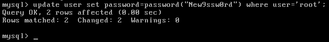](https://files.jb51.net/file_images/article/201703/2017031709023925.png)

8.输入"flush privileges;"更新权限。

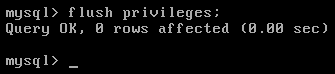

9.输入“quit”并按回车键退出。

注意：此处不需输入分号。

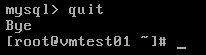

10.输入"service mysqld restart"重启mysqld服务。

[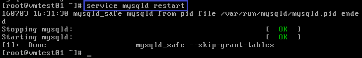](https://files.jb51.net/file_images/article/201703/2017031709024128.png)

11.输入“mysql -u root -p”并按回车键提示输入密码。

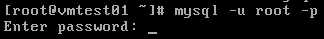

12.输入新密码root并按回车键，提示已经成功登录。