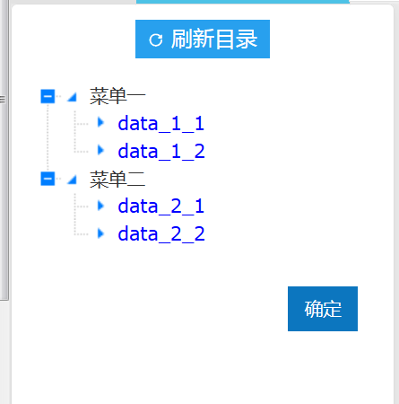
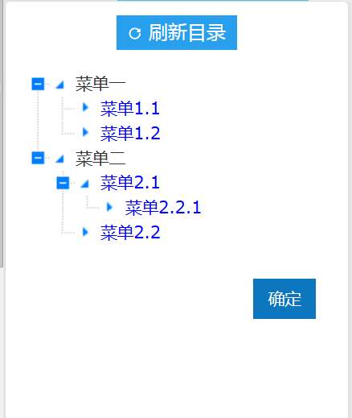
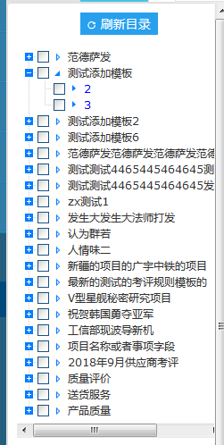
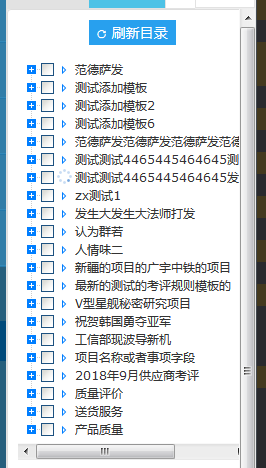
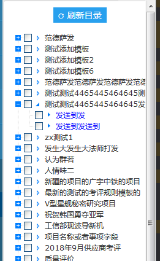
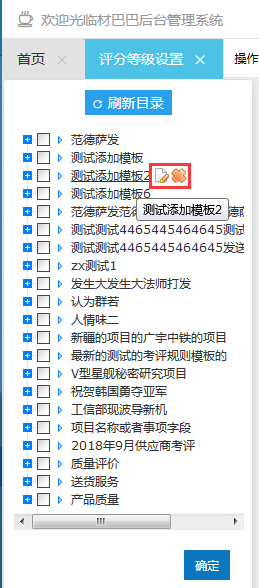
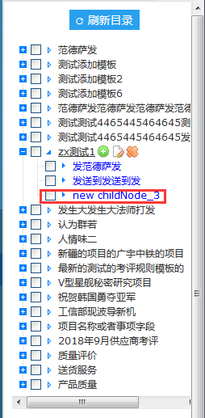
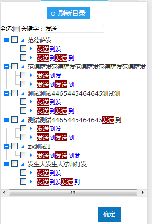
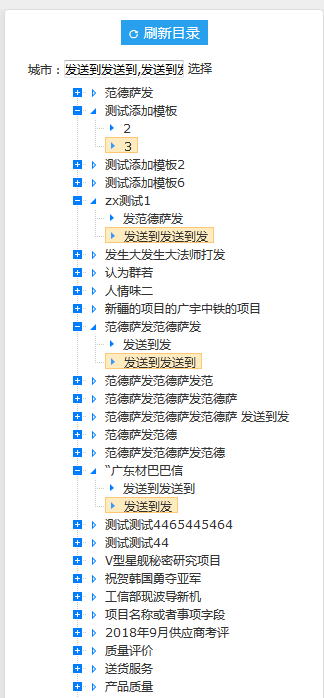
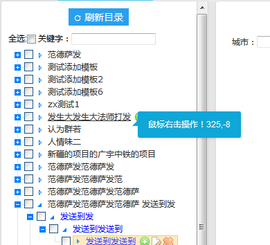

# 	zTree

## 简介

​     zTree 是一个依靠 jQuery 实现的多功能 “树插件”。优异的性能、灵活的配置、多种功能的组合是 zTree 最大优点。[zTree官方API文档链接](http://www.treejs.cn/v3/api.php)

+ zTree v3.0 将核心代码按照功能进行了分割，不需要的代码可以不用加载 
+ 采用了 延迟加载 技术，上万节点轻松加载，即使在 IE6 下也能基本做到秒杀 
+ 兼容 IE、FireFox、Chrome、Opera、Safari 等浏览器 
+ ==支持 JSON 数据==
+ 支持静态 和 Ajax 异步加载节点数据 
+ 支持任意更换皮肤 / 自定义图标（依靠css） 
+ 支持极其灵活的 checkbox 或 radio 选择功能 
+ 提供多种事件响应回调 
+ 灵活的编辑==（增/删/改/查）==功能，可随意==拖拽节点==。
+ 在一个页面内可同时生成多个 Tree 实例 


## 准备

​      如果项目里没有zTree插件的相关文件，需要前往官网下载  [zTree配置文件 ](http://www.treejs.cn/v3/main.php) 引入到页面里。因为zTree是依赖 `jQuery`的，所以还需要引入`jQuery.js`。(zTree开发依赖的`jQuery`版本为1.4.4，需引入本版本或以上版本,原cgcoms项目的zTree版本为3.5.17,现更新至最新版3.5.37)

```jsp
<!-- jQuery.js放在一下jsp中 -->
<%@include file="/WEB-INF/cgpt/common/base_init.jsp"%>
<!-- zTree的样式css -->
<link rel="stylesheet" href="/common_res/js/zTree_v3/css/zTreeStyle/zTreeStyle.css" type="text/css">
<!-- zTree初始化方法等需要引入以下包 -->
<script  type="text/javascript" src="/common_res/js/zTree_v3/js/jquery.ztree.core-3.5.js"></script>
<!-- 如果需要用到 编辑功能 或 checkbox / radio 需要引入以下包 -->
<script type="text/javascript" src="/common_res/js/zTree_v3/js/jquery.ztree.excheck-3.5.js"></script>
<script type="text/javascript" src="/common_res/js/zTree_v3/js/jquery.ztree.exedit-3.5.js"></script>
<!-- zTree也有一个总包jquery.ztree.all-3.5.js，all.js= core + excheck + exedit ( 不包括 exhide );-->
```

## zTree方法

 $.fn.zTree :

```javascript
 $.fn.zTree {
     init($("#tree"), setting, zTreeNodes);// zTree 初始化方法，创建 zTree 必须使用此方法
     getZTreeObj("tree");// 根据 treeId 获取 zTree 对象的方法。 
     destroy("tree"); // 提供销毁 zTree 的方法。 
 }
```

zTreeObj :

```javascript
zTreeObj :{
    setting; //zTree 对象使用的 setting 配置数据
    addNodes(parentObj,newNode); // 添加节点。parentObj:父类对象，newNode：节点数据
    cancelSelectedNode(node); // 取消节点的选中状态。node:节点对象
    checkAllNodes(true); // 勾选 或 取消勾选 全部节点
    checkNode(nodes[i], true, true); // 勾选 或 取消勾选 单个节点
    copyNode(nodes[0], nodes[1], "before"); // 复制节点。
    destroy(); // 提供销毁 zTree 的方法
    editName(nodes);//设置某节点进入编辑名称状态。
    expandAll(true);// 展开 / 折叠 全部节点
    expandNode(nodes[0], true, true, true); // 展开 / 折叠 指定的节点
    getNodeByTId("tree_10"); // 根据 zTree 的唯一标识 tId 快速获取节点 JSON 数据对象 ,这个唯一标识不是我们JSON数据里的id，而是zTree根据生成规则：setting.treeId + "_" + 内部计数，生成出来的
    getNodeIndex(nodes[0]); // 获取某节点在同级节点中的序号（从0开始)
    getNodes();// 获取 zTree 的全部节点数据
    getNodesByFilter(filter); // 根据自定义规则搜索节点数据 JSON 对象集合 或 单个节点数据
    getNodesByParam("name", "test", null); // 根据节点数据的属性搜索，获取条件完全匹配的节点数据 JSON 对象集合
    getNodesByParamFuzzy("name", "test", null);//根据节点数据的属性搜索，获取条件模糊匹配的节点数据 JSON 对象集合
    getSelectedNodes()；// 获取 zTree 当前被选中的节点数据集合(选中的节点名)
    getChangeCheckedNodes(); // 获取输入框勾选状态被改变的节点集合（与原始数据 checkedOld 对比）
    getCheckedNodes(true); // 获取输入框被勾选 或 未勾选的节点集合。
    hideNode(nodes[0]); // 隐藏某个节点。
    hideNodes(nodes[0].children);// 隐藏一批节点。
    showNode(node); // 显示某个被隐藏的节点。
    showNodes(nodes);//显示一批已经被隐藏的节点。
    moveNode(nodes[0], nodes[1], "inner");//移动节点。("移动的节点"，"需要移动到的节点"，"位置")
    reAsyncChildNodes(nodes[0], "refresh");// 强行异步加载父节点的子节点。
    removeChildNodes(nodes[0]);//清空某父节点的子节点。
    removeNode(nodes[i]);//删除节点。
    selectNode(nodes[0]);//选中指定节点
        setChkDisabled(nodes[i], true);//禁用 或 解禁 某个节点的 checkbox / radio
    setEditable(true);// 设置 zTree 进入 / 取消 编辑状态。
    transformToArray(treeObj.getNodes());//将 zTree 使用的标准 JSON 嵌套格式的数据转换为简单 Array 格式
    transformTozTreeNodes(simpleNodes); // 将简单 Array 格式数据转换为 zTree 使用的标准 JSON 嵌套数据格式。
    updateNode(nodes[0]);//更新某节点数据，主要用于该节点显示属性的更新。
}
```

## treeNode 节点数据 

```javascript
treeNode : {
    name;//节点名称。
    open;//记录 treeNode 节点的 展开 / 折叠 状态。
    url;//节点链接的目标 URL
    target;//设置点击节点后在何处打开 url。"_blank", "_self" 或 其他指定窗口名称 
    children; // 节点的子节点数据集合。
    chkDisabled;//设置节点的 checkbox / radio 是否禁用
    click;// 最简单的 click 事件操作。相当于 onclick="..." 的内容。
    getCheckStatus();// 获取节点 checkbox / radio 半勾选状态。
    getIndex();// 获取 treeNode 节点在同级节点中的位置。
    getPreNode();//获取与 treeNode 节点相邻的前一个节点。
    getNextNode(); //获取与 treeNode 节点相邻的后一个节点。
    getParentNode();//获取 treeNode 节点的父节点。
    getPath();// 获取 treeNode 节点的所有父节点（包括自己）。
    icon; // 节点自定义图标的 URL 路径。
    iconClose;//父节点自定义折叠时图标的 URL 路径。
    iconOpen;//父节点自定义展开时图标的 URL 路径。
    iconSkin;//节点自定义图标的 className
    isHidden;//判断 treeNode 节点是否被隐藏。
    isParent;//记录 treeNode 节点是否为父节点。
    nocheck;//设置节点是否隐藏 checkbox / radio
    
    tId;//treeNode 节点的唯一标识 tId。
    parentTId;//treeNode 节点的父节点唯一标识 tId。
    isHover;//记录节点 的 hover 状态
    editNameFlag;//用于记录节点是否处于编辑名称状态。
    isFirstNode;//记录 treeNode 节点是否为同级节点中的第一个节点。	
    isLastNode;// 记录 treeNode 节点是否为同级节点中的最后一个节点。
    level;//记录节点的层级;根节点 level = 0，依次递增
    check_Child_State;//用于设置节点的子节点的 checkBox / radio 的半选状态。
    checkedOld;//节点的 checkBox / radio 在初始化时的 勾选状态。
    isAjaxing;//记录 treeNode 节点是否正在进行异步加载。
    zAsync;//记录 treeNode 节点是否已经进行过异步加载，避免父节点反复异步加载数据。
}
```


## 编写html页面

+ ==<!DOCTYPE html>==是必须的
+ zTree 的容器 的className 默认为"==ztree=="，如果有需要也可以进源码里修改 

### (1)标准树

```jsp
<!DOCTYPE html>
<HTML>
 <HEAD>
  <TITLE> ZTREE DEMO </TITLE>
  <meta http-equiv="content-type" content="text/html; charset=UTF-8">
<!-- jQuery.js放在一下jsp中 -->
<%@include file="/WEB-INF/cgpt/common/base_init.jsp"%>
<!-- zTree的样式css -->
<link rel="stylesheet" href="/common_res/js/zTree_v3/css/zTreeStyle/zTreeStyle.css" type="text/css">
<!-- zTree初始化方法等需要引入以下包 -->
<script  type="text/javascript" src="/common_res/js/zTree_v3/js/jquery.ztree.core-3.5.js"></script>
<!-- 如果需要用到 编辑功能 或 checkbox / radio 需要引入以下包 -->
<script type="text/javascript" src="/common_res/js/zTree_v3/js/jquery.ztree.excheck-3.5.js"></script>
<script type="text/javascript" src="/common_res/js/zTree_v3/js/jquery.ztree.exedit-3.5.js"></script>
<SCRIPT LANGUAGE="JavaScript">
   var zTreeObj;
   // 当要做一个标准树的时候，setting什么都不需要写，为{ }
      var setting = {
          
      };
   // zTree 标准树的数据格式
   var zNodes = [
      {
        name:"菜单一", open:false, children:[
          {name:"data_1_1"},
          {name:"data_1_2"}
       ]},
       {
        name:"菜单二", open:false, children:[
          {name:"data_2_1"}, 
          {name:"data_2_2"}
        ]}
   ];
   $(document).ready(function(){
      zTreeObj = $.fn.zTree.init($("#treeDemo"), setting, zNodes);
   });
</SCRIPT>
</HEAD>
<BODY>
<div>
   <ul id="treeDemo" class="ztree"></ul>
</div>
</BODY>
</HTML>
```



### (2)简单树

```jsp
<%@ page language="java" pageEncoding="UTF-8"%>
<!DOCTYPE html>
<html lang="zh">
<head>
<meta charset="UTF-8">
<meta http-equiv="X-UA-Compatible" content="IE=edge">
<meta name="viewport" content="width=device-width, initial-scale=1">
<title></title>
<!-- jQuery.js放在一下jsp中 -->
<%@include file="/WEB-INF/cgpt/common/base_init.jsp"%>
<!-- zTree的样式css -->
<link rel="stylesheet" href="/common_res/js/zTree_v3/css/zTreeStyle/zTreeStyle.css" type="text/css">
<!-- zTree初始化方法等需要引入以下包 -->
<script  type="text/javascript" src="/common_res/js/zTree_v3/js/jquery.ztree.core-3.5.js"></script>
<!-- 如果需要用到 编辑功能 或 checkbox / radio 需要引入以下包 -->
<script type="text/javascript" src="/common_res/js/zTree_v3/js/jquery.ztree.excheck-3.5.js"></script>
<script type="text/javascript" src="/common_res/js/zTree_v3/js/jquery.ztree.exedit-3.5.js"></script>
<script type="text/javascript" >
	var zTreeObj;
	// 做一个简单树的时候，setting需要设置simpleData样本数据
	var setting = {
		  data:{
			  simpleData:{
				  enable: true,
				  idKey: "id",
				  pIdKey: "pId",
			  }
		  }
	},
<%--    zTreeNodes = ${responseJson};--%>
    // id:本节点的id   pId:父节点的id name:节点名称    
    zTreeNodes=[
         {"id":"1","pId":"0","name":"菜单一"},
         {"id":"2","pId":"0","name":"菜单二"},
         {"id":"101","pId":"1","name":"菜单1.1"},
         {"id":"102","pId":"1","name":"菜单1.2"},
         {"id":"201","pId":"2","name":"菜单2.1"},
         {"id":"202","pId":"2","name":"菜单2.2"},
         {"id":"20201","pId":"201","name":"菜单2.2.1"},
    ]
    
	$(document).ready(function(){
		console.log(${responseJson});
		// zTree的初始化方法
		zTreeObj = $.fn.zTree.init($("#tree"), setting, zTreeNodes);
	});
</script>
</head>
<body>
    <ul id="tree" class="ztree" style="width:230px; overflow:auto;"></ul>
</body>
<script>

</script>
</html>
```



###(3)数据格式

zTree是支持JSON数据的，所以在数据处理上要做成JSON数据的格式，后台返回页面的数据格式推荐使用以下格式：==（id:本节点的id    pId:父节点的id    name:节点名称   也可以自定义属性和值）==  

```javascript
	zTreeNodes=[
		   {"id":"1","pId":"0","name":"菜单一","children":[{"id":"101","pId":"1","name":"菜单1.1",}]},
		   {"id":"2","pId":"0","name":"菜单二","children":[{"id":"201","pId":"2","name":"菜单2.1",}]}  
		]
```

或者：

```json
    zTreeNodes=[
         {"id":"1","pId":"0","name":"菜单一"，"custom","自定义属性"},
         {"id":"2","pId":"0","name":"菜单二"},
         {"id":"101","pId":"1","name":"菜单1.1"},
         {"id":"102","pId":"1","name":"菜单1.2"},
         {"id":"201","pId":"2","name":"菜单2.1"},
         {"id":"202","pId":"2","name":"菜单2.2"},
         {"id":"20201","pId":"201","name":"菜单2.2.1"},
    ]
```

###(4)节点点击事件

需要在setting中配置callback。

```javascript
	var setting = {
		  data:{
     		  // 做一个简单的时候，setting需要设置simpleData样本数据
			  simpleData:{
				  enable: true,
				  idKey: "id",
				  pIdKey: "pId",
			  }
		  },
		  callback: {
			  // 节点点击的回调事件
			  onClick: 
              
		  }
	};
	function zTreeOnClick(event, treeId, treeNode) {
	    // treeNode为当前点击的节点，可以取出节点的属性值
        alert(treeNode.id + ", " + treeNode.name+ ", " + treeNode.pId);
	};
```

### (5)简单的例子

#### main.jsp

```jsp
<%@ page language="java" pageEncoding="UTF-8"%>
<!DOCTYPE html>
<html lang="zh">
<head>
<meta charset="UTF-8">
<meta http-equiv="X-UA-Compatible" content="IE=edge">
<meta name="viewport" content="width=device-width, initial-scale=1">
<title></title>
</head>
<body>
   <%@include file="tree.jsp"%>
   <div class="embed-responsive iframeHeight" style="background:#fff;">
         <--iframe页面就不展示了，只需要确认数据传输过去就行-->	
		<iframe src="/appraiser/ruleModelList" frameborder="0" id="rightFrame" name="rightFrame"></iframe>
    </div>
</body>
</html>
```

#### mainAct.java

```java
         ModelAndView mav = new ModelAndView("main");
		// 创建一个JSONArray对象，用于存放所有的树数据。
		JSONArray jsonArray = new JSONArray();
		// 创建节点对象,用于存放节点数据
		Map<String, Object> nodeMap = new HashMap<String, Object>();
		List<AppraiserRuleModel> ruleModelList = appraiserRuleModelMng.findAll();
		HashSet<String> itemSet=new HashSet<String>();
		for(AppraiserRuleModel appraiserRuleModel:ruleModelList){
			if(!itemSet.contains(appraiserRuleModel.getAppraiserItem())){
				itemSet.add(appraiserRuleModel.getAppraiserItem());
				nodeMap.put("id", appraiserRuleModel.getAppraiserItem());
				nodeMap.put("pId", 0);
				nodeMap.put("name", appraiserRuleModel.getAppraiserItem());
				nodeMap.put("open", false);
				jsonArray.put(nodeMap);
				nodeMap.clear();
			}
			nodeMap.put("id", appraiserRuleModel.getId());
			nodeMap.put("pId", appraiserRuleModel.getAppraiserItem());
			nodeMap.put("itemName", appraiserRuleModel.getAppraiserItem());
			nodeMap.put("name", appraiserRuleModel.getAppraiserEvent());
			nodeMap.put("open", false);
			jsonArray.put(nodeMap);
			nodeMap.clear();
		}
		String responseJson = jsonArray.toString();
		mav.addObject("responseJson", responseJson);
		return mav;
```

####tree.jsp

```jsp
<%@ page language="java" pageEncoding="UTF-8"%>
<!DOCTYPE html>
<html lang="zh">
<head>
<meta charset="UTF-8">
<meta http-equiv="X-UA-Compatible" content="IE=edge">
<meta name="viewport" content="width=device-width, initial-scale=1">
<title></title>
<!-- jQuery.js放在一下jsp中 -->
<%@include file="/WEB-INF/cgpt/common/base_init.jsp"%>
<!-- zTree的样式css -->
<link rel="stylesheet" href="/common_res/js/zTree_v3/css/zTreeStyle/zTreeStyle.css" type="text/css">
<!-- zTree初始化方法等需要引入以下包 -->
<script  type="text/javascript" src="/common_res/js/zTree_v3/js/jquery.ztree.core-3.5.js"></script>
<!-- 如果需要用到 编辑功能 或 checkbox / radio 需要引入以下包 -->
<script type="text/javascript" src="/common_res/js/zTree_v3/js/jquery.ztree.excheck-3.5.js"></script>
<script type="text/javascript" src="/common_res/js/zTree_v3/js/jquery.ztree.exedit-3.5.js"></script>
<script type="text/javascript" >

<%--    // id:本节点的id   pId:父节点的id name:节点名称 --%>
<%--    zTreeNodes=[--%>
<%--         {"id":"1","pId":"0","name":"菜单一"},--%>
<%--         {"id":"2","pId":"0","name":"菜单二"},--%>
<%--         {"id":"101","pId":"1","name":"菜单1.1"},--%>
<%--         {"id":"102","pId":"1","name":"菜单1.2"},--%>
<%--         {"id":"201","pId":"2","name":"菜单2.1"},--%>
<%--         {"id":"202","pId":"2","name":"菜单2.2"},--%>
<%--         {"id":"20201","pId":"201","name":"菜单2.2.1","url":"http://www.baidu.com"},--%>
<%--    ]--%>

	var zTreeObj;
	var setting = {
        data:{
            // 做一个简单的时候，setting需要设置simpleData样本数据
            simpleData:{
                enable: true,
                idKey: "id",
                pIdKey: "pId",
                rootPId: 0
            }
        },
        callback: {
            // 节点点击的回调事件
            onClick: zTreeOnClick
        },
        check: {
				enable: true,
				chkStyle: "checkbox", // checkbox和radio
		},
	};
	
	$(document).ready(function(){
		// 得到zTree树的JSON数据
        var zTreeNodes = ${responseJson};
		// zTree的初始化方法
		zTreeObj = $.fn.zTree.init($("#tree"), setting, zTreeNodes);
	});
	
	function zTreeOnClick(event, treeId, treeNode) {
        // rightFrame为main.jsp的子iframe的ID
	    if(treeNode.id == treeNode.name){
	       $("#rightFrame").attr("src","/appraiser/ruleModelList?appraiserItem="+treeNode.name);	    	
	    }else{
	       $("#rightFrame").attr("src","/appraiser/ruleModelList?appraiserItem="+treeNode.itemName+"&appraiserEvent="+treeNode.name);
	    }
	};
</script>
</head>
<body>
<div class="zTreeDemoBackground box" id="frameTree">
	<div class="text-center">
		<a href="/abTest/ruleModelMenu" class="treeButton"><i class="iconfont">&#xe6b0;</i>刷新目录</a>
	</div>
        <ul id="tree" class="ztree" style="width:230px; overflow:auto;"></ul>
</div>
</body>
</html>
```



### (6)异步加载子节点

Controller:

```java
	@RequestMapping(value="/abTest/ruleModelMenu")
	public ModelAndView ruleModelMenuAsync(){
		ModelAndView mav = new ModelAndView("/abTest/ruleModelMenu");
		// 获取父节点数据
		List<String> itemStringList = appraiserRuleModelMng.findUniqueItem();
		JSONArray jsonArrayAsync = new JSONArray();
		Map<String, Object> nodeMapAsync = new HashMap<String, Object>();
		for(String itemString : itemStringList){
			nodeMapAsync.put("id",itemString);
			nodeMapAsync.put("name", itemString);
			nodeMapAsync.put("pId",0);
			// 设置为父节点
			nodeMapAsync.put("isParent",true);
			nodeMapAsync.put("open",false);
			jsonArrayAsync.put(nodeMapAsync);
			nodeMapAsync.clear();
		}
		String responseJson = jsonArrayAsync.toString();
		mav.addObject("responseJson", responseJson);
		return mav;
	}

```

jsp页面setting配置：

```javascript
var setting = {
		  async: {
				enable: true,
				type: "get",
                 dataType: "text",
				contentType: "application/x-www-form-urlencoded; charset=utf-8",
				url: "/abTest/findChildNodeAsync",
				// autoParam-->异步加载时需要自动提交父节点属性的参数,
                 // name-->为节点的name属性，可以改成id或其他自定义属性
                 // 格式-->["树节点的属性名 = Controller方法需要的形参名"]
				autoParam: ["name=appraiserItem"],
                 // otherParam: ["name", "name的值"]--> Ajax 请求提交的静态参数键值对
                
                 // ajaxDataFilter 用于对 Ajax 返回数据进行预处理的函数
				dataFilter: ajaxDataFilter
			},
	};

// treeId:对应 zTree 的 treeId 
// parentNode:进行异步加载的父节点 JSON 数据对象
// responseData:异步加载获取到的数据转换后的 Array(JSON) / JSON / String 数据对象
function ajaxDataFilter(treeId, parentNode, responseData) {
	    if (responseData) {
	      for(var i =0; i < responseData.length; i++) {
	         responseData[i].name=responseData[i].name.substring(0,10)
	      }
	    }
	    return responseData;
	};
```

发送的是异步请求，Controller方法上需要加上@ResponseBody注解提供JSON格式数据

```java
    /**
	 * appraiserItem 项目名
	 * 同步拿到考评项目和考评事项
	 * @return
	 */	
    @ResponseBody
	@RequestMapping(value="/abTest/findChildNodeAsync")
	public List<Map<String, Object>> findChildNodeAsync(String appraiserItem){
		// 处理异步数据
		List<AppraiserRuleModel> appraiserRuleModelList =null;
		List<Map<String, Object>> nodeMapList = new ArrayList<Map<String, Object>>();
		if(StringUtils.isNotBlank(appraiserItem)){			
			appraiserRuleModelList = appraiserRuleModelMng.findByProperty("appraiserItem", appraiserItem);
			for(AppraiserRuleModel appraiserRuleModel : appraiserRuleModelList){
				Map<String, Object> nodeMapAsync = new HashMap<String, Object>();
				nodeMapAsync.put("id",appraiserRuleModel.getId());
				nodeMapAsync.put("name", appraiserRuleModel.getAppraiserEvent());
				nodeMapAsync.put("pId",appraiserRuleModel.getAppraiserItem());
				// 设置项目名称
				nodeMapAsync.put("itemName", appraiserRuleModel.getAppraiserItem());
				// 设置为子节点
				nodeMapAsync.put("isParent",false);
				nodeMapAsync.put("open",false);
				nodeMapList.add(nodeMapAsync);
			}
		}
		return nodeMapList;
	}
```

​                                        

### (7)callback回调函数

更多函数或具体参数请前往 [官方API文档](http://www.treejs.cn/v3/api.php) 查阅

```javascript
callback: {
   beforeClick:zTreeBeforeClick, // 节点点击调用，根据返回值判断能否进行onClick操作,Ps:虽然需要的是Boolean值,但是不能直接写true或者false,一定要是函数的返回值 
   beforeAsync: zTreeBeforeAsync,// 异步请求之前调用，同上
   onAsyncSuccess: zTreeOnAsyncSuccess,// 异步请求成功之后调用
   onAsyncError: zTreeOnAsyncError,// 异步请求错误之后调用
   beforeDrag: zTreeBeforeDrag,// 捕获节点被拖拽之前的事件回调函数，并且根据返回值确定是否允许开启拖拽操作 需要开启edit->enable=true
   onRename: zTreeOnRename,// 节点修改之后调用 需要开启edit->enable=true
   onRemove: zTreeOnRemove,// 用于捕获删除节点之后的事件回调函数。
   onClick: zTreeOnClick, // 节点点击的回调事件
   beforeRightClick: zTreeBeforeRightClick,//鼠标右键点击之前的事件回调函数，并且根据返回值确定触发 onRightClick 事件回调函数
   onRightClick: zTreeOnRightClick,//鼠标右键点击之后的事件回调函数
		  },
```

### (8)编辑节点

edit开启之后，鼠标悬停节点时显示编辑和删除按钮，或者自定义按钮。

```javascript
 edit: {
	enable: true,// 开启编辑
    showRemoveBtn: setRemoveBtn,//设置是否显示删除按钮
	showRenameBtn: setRenameBtn,//设置是否显示编辑名称按钮
 },
```



自定义添加一个新增子节点按钮。

```javascript
		view: {
			fontCss : setFontCss,// 设置节点名称的样式
			addHoverDom: addHoverDom,// 鼠标移动到节点上时，显示用户自定义控件
			removeHoverDom: removeHoverDom,//鼠标移出节点时，隐藏用户自定义控件
			selectedMulti: true, //设置是否允许同时选中多个节点。(节点名称)
		}
```

在添加子节点的时候，你可以自定义你需要的节点的属性，放到{}里，如果需要添加多个节点，只需添加的数据为数组格式就行[ { },{ },{ } ]

```javascript
var newCount = 1;
	// 鼠标移动到节点时，显示添加按钮
	function addHoverDom(treeId, treeNode) {
		var sObj = $("#" + treeNode.tId + "_span");
		// 如果节点处于编辑状态 或者 本节点已经存在新增按钮,return;
		if (treeNode.editNameFlag || $("#addBtn_"+treeNode.tId).length>0) return;
		var addStr = "<span class='button add' id='addBtn_" + treeNode.tId
			+ "' title='add node' onfocus='this.blur();'></span>";
		sObj.after(addStr);
		var btn = $("#addBtn_"+treeNode.tId);
		if (btn) btn.bind("click", function(){
			var zTree = $.fn.zTree.getZTreeObj("tree");
			zTree.addNodes(treeNode, {pId:treeNode.id, name:"new childNode_" + (newCount++)});
			return false;
		});
	};
	// 鼠标移动到节点时，移除添加按钮
	function removeHoverDom(treeId, treeNode) {
		$("#addBtn_"+treeNode.tId).unbind().remove();
	};
```



### (9)视图

````javascript
view: {
		    fontCss : setFontCss,// 设置节点名称的样式
			addHoverDom: addHoverDom,// 鼠标移动到节点上时，显示用户自定义控件
			removeHoverDom: removeHoverDom,//鼠标移出节点时，隐藏用户自定义控件
			selectedMulti: true,//设置是否允许同时选中多个节点。
             editNameSelectAll: true,//节点编辑名称 input 初次显示时,设置 txt 内容是否为全选状态。
             dblClickExpand : false,// 为了避免与双击功能冲突，建议关闭双击展开节点的功能    
	}
````

## 模糊匹配

依赖的js，如cgcoms项目的zTree原版本为 v3.5.17.如需使用此模糊搜索，需要使用新的版本。

- ztree ==v3.5.19.1==及以上,使用到getPath()方法
- ztree.==exhide==扩展,使用到hideNode()方法

###引入

```javascript
<!-- jQuery.js放在以下jsp中 -->
<%@include file="/WEB-INF/cgpt/common/base_init.jsp"%>
<!-- zTree的样式css -->
<link rel="stylesheet" href="/common_res/js/zTree_v3/css/zTreeStyle/zTreeStyle.css" type="text/css">
<!-- 或者引入zTree的all包 -->
<script type="text/javascript" src="/common_res/js/zTree_v3/js/jquery.ztree.all-3.5.js"></script>
<script type="text/javascript" src="/common_res/js/zTree_v3/js/jquery.ztree.exhide-3.5.js"></script>
<script type="text/javascript" src="/common_res/js/zTree_v3/js/fuzzysearch.js"></script>
<style type="text/css">
.ztree li span.button.add{margin-left:3px;background-position:-144px 0;vertical-align:top;*vertical-align:middle}
</style>
```

###fuzzysearch.js

需要手动引入，此js文件不在zTree的下载包中

```javascript
/**
 * @param zTreeId the ztree id used to get the ztree object
 * @param searchField selector of your input for fuzzy search
 * @param isHighLight whether highlight the match words, default true
 * @param isExpand whether to expand the node, default false
 * @param buttonObj 是否添加按钮控制搜索，如果添加，buttonObj为按钮对象
 */	
 function fuzzySearch(zTreeId, searchField, isHighLight, isExpand,buttonObj){
	 var zTreeObj = $.fn.zTree.getZTreeObj(zTreeId);//get the ztree object by ztree id
	 if(!zTreeObj){
		 alter("fail to get ztree object");
	 }
	var nameKey = zTreeObj.setting.data.key.name; //get the key of the node name
	isHighLight = isHighLight===false?false:true;//default true, only use false to disable highlight
	isExpand = isExpand?true:false; // not to expand in default
	zTreeObj.setting.view.nameIsHTML = isHighLight; //allow use html in node name for highlight use
	
	var metaChar = '[\\[\\]\\\\\^\\$\\.\\|\\?\\*\\+\\(\\)]'; //js meta characters
	var rexMeta = new RegExp(metaChar, 'gi');//regular expression to match meta characters
	
	// keywords filter function 
	function ztreeFilter(zTreeObj,_keywords,callBackFunc) {
		if(!_keywords){
			_keywords =''; //default blank for _keywords 
		}
		
		// function to find the matching node
		function filterFunc(node) {
			if(node && node.oldname && node.oldname.length>0){
				node[nameKey] = node.oldname; //recover oldname of the node if exist
			}
			zTreeObj.updateNode(node); //update node to for modifications take effect
			if (_keywords.length == 0) {
				//return true to show all nodes if the keyword is blank
				zTreeObj.showNode(node);
				zTreeObj.expandNode(node,isExpand);
				return true;
			}
			//transform node name and keywords to lowercase
			if (node[nameKey] && node[nameKey].toLowerCase().indexOf(_keywords.toLowerCase())!=-1) {
				if(isHighLight){ //highlight process
					//a new variable 'newKeywords' created to store the keywords information 
					//keep the parameter '_keywords' as initial and it will be used in next node
					//process the meta characters in _keywords thus the RegExp can be correctly used in str.replace
					var newKeywords = _keywords.replace(rexMeta,function(matchStr){
						//add escape character before meta characters
						return '\\' + matchStr;
					});
					node.oldname = node[nameKey]; //store the old name  
					var rexGlobal = new RegExp(newKeywords, 'gi');//'g' for global,'i' for ignore case
					//use replace(RegExp,replacement) since replace(/substr/g,replacement) cannot be used here
					node[nameKey] = node.oldname.replace(rexGlobal, function(originalText){
						//highlight the matching words in node name
						var highLightText =
							'<span style="color: whitesmoke;background-color: #f08300;">'
							+ originalText
							+'</span>';
						return 	highLightText;					
					});
					zTreeObj.updateNode(node); //update node for modifications take effect
				}
				zTreeObj.showNode(node);//show node with matching keywords
				return true; //return true and show this node
			}
			
			zTreeObj.hideNode(node); // hide node that not matched
			return false; //return false for node not matched
		}
		
		var nodesShow = zTreeObj.getNodesByFilter(filterFunc); //get all nodes that would be shown
		processShowNodes(nodesShow, _keywords);//nodes should be reprocessed to show correctly
	}
	
	/**
	 * reprocess of nodes before showing
	 */
	function processShowNodes(nodesShow,_keywords){
		if(nodesShow && nodesShow.length>0){
			//process the ancient nodes if _keywords is not blank
			if(_keywords.length>0){ 
				$.each(nodesShow, function(n,obj){
					var pathOfOne = obj.getPath();//get all the ancient nodes including current node
					if(pathOfOne && pathOfOne.length>0){ 
						//i < pathOfOne.length-1 process every node in path except self
						for(var i=0;i<pathOfOne.length-1;i++){
							zTreeObj.showNode(pathOfOne[i]); //show node 
							zTreeObj.expandNode(pathOfOne[i],true); //expand node
						}
					}
				});	
			}else{ //show all nodes when _keywords is blank and expand the root nodes
				var rootNodes = zTreeObj.getNodesByParam('level','0');//get all root nodes
				$.each(rootNodes,function(n,obj){
					zTreeObj.expandNode(obj,isExpand); //expand all root nodes
				});
			}
		}
	}
	if(!buttonObj){
		//无搜索按钮 listen to change in input element
		$(searchField).bind('input propertychange', function() {
			var _keywords = $(this).val();
			searchNodeLazy(_keywords); //call lazy load
		});
	}else if($(buttonObj)){
		//加了一个搜索按钮
		$(buttonObj).click(function(){
	    	var _keywords = $(searchField).val();
			searchNodeLazy(_keywords); //call lazy load
		})
	}

	var timeoutId = null;
	// excute lazy load once after input change, the last pending task will be cancled  
	function searchNodeLazy(_keywords) {
		if (timeoutId) { 
			//clear pending task
			clearTimeout(timeoutId);
		}
		timeoutId = setTimeout(function() {
			ztreeFilter(zTreeObj,_keywords); //lazy load ztreeFilter function 
			$(searchField).focus();//focus input field again after filtering
		}, 500);
	}
}
```

###初始化模糊搜索方法

```javascript
	$(document).ready(function(){
		// 得到zTree树的JSON数据
        var zTreeNodes = ${responseJson};
		// zTree的初始化方法
		zTreeObj = $.fn.zTree.init($("#tree"), setting, zTreeNodes);
		
        // 初始化模糊搜索方法 
		//1 tree：zTree的ID
		//2 key：搜索框id
		//3 搜索结果是否高光显示
		//4 搜索之后根节点展开/收起
		//5 是否开启按钮搜索,如开启，传递按钮的id对象，如'#id'。不开启为false
		fuzzySearch('tree','#key',true,false,false); 
	});
```

###搜索框

```html
关键字：<input type="text" id="key" value="" class="empty" />
```

###效果图




## 下拉框

```javascript
<%--var zNodes =[
		{id:1, pId:0, name:"北京"},
		{id:2, pId:0, name:"天津"},
		{id:3, pId:0, name:"上海"},
		{id:6, pId:0, name:"重庆"},
		{id:4, pId:0, name:"河北省", open:true},
		{id:41, pId:4, name:"石家庄"},
		{id:42, pId:4, name:"保定"},
		{id:43, pId:4, name:"邯郸"},
		{id:44, pId:4, name:"承德"},
		{id:5, pId:0, name:"广东省", open:true},
		{id:51, pId:5, name:"广州"},
		{id:52, pId:5, name:"深圳"},
		{id:53, pId:5, name:"东莞"},
		{id:54, pId:5, name:"佛山"},
		{id:6, pId:0, name:"福建省", open:true},
		{id:61, pId:6, name:"福州"},
		{id:62, pId:6, name:"厦门"},
		{id:63, pId:6, name:"泉州"},
		{id:64, pId:6, name:"三明"}
	 ];--%>
    var zNodes = ${responseJson};
    var setting = {
            view: {
                dblClickExpand: false,//关闭双击节点展开
                selectedMulti: true,//设置是否允许同时选中多个节点。
            },
            data: {
                simpleData: {
                    enable: true
                }
            },
            callback: {
                beforeClick: beforeClick,
                onClick: onClick
            }
        };
	function beforeClick(treeId, treeNode) {
		var check = (treeNode && !treeNode.isParent);
		if (!check) alert("只能选择城市...");
		return check;
	}
	
	function onClick(e, treeId, treeNode) {
		var zTree = $.fn.zTree.getZTreeObj("treeDemo"),
		nodes = zTree.getSelectedNodes(),
		v = "";
		nodes.sort(function compare(a,b){return a.id-b.id;});
		for (var i=0, l=nodes.length; i<l; i++) {
			v += nodes[i].name + ",";
		}
		if (v.length > 0 ) v = v.substring(0, v.length-1);
		var cityObj = $("#citySel");
		cityObj.attr("value", v);
	}

	function showMenu() {
		var cityObj = $("#citySel");
		var cityOffset = $("#citySel").offset();
		$("#menuContent").css({left:cityOffset.left + "px", top:cityOffset.top + cityObj.outerHeight() + "px"}).slideDown("fast");

		$("body").bind("mousedown", onBodyDown);
	}
	function hideMenu() {
		$("#menuContent").fadeOut("fast");
		$("body").unbind("mousedown", onBodyDown);
	}
	function onBodyDown(event) {
		if (!(event.target.id == "menuBtn" || event.target.id == "menuContent" || $(event.target).parents("#menuContent").length>0)) {
			hideMenu();
		}
	}
	$(document).ready(function(){
		$.fn.zTree.init($("#treeDemo"), setting, zNodes);
	});
```

```html
<div class="zTreeDemoBackground box" id="frameTree" style="width:320px">
	<div class="text-center">
		<a href="/abTest/ruleModelMenu" class="treeButton"><i class="iconfont">&#xe6b0;</i>刷新目录</a>
	    <ul id="treeSelect" class="ztree" style="width:300px; overflow:auto;">
	    <ul class="list">
			<li class="title">&nbsp;&nbsp;城市：<input id="citySel" type="text" readonly value="" style="width:120px;"/>&nbsp;<a id="menuBtn" href="#" onclick="showMenu(); return false;">选择</a></li>
		</ul>
	    <div id="menuContent" class="menuContent" style="display:none; position: absolute;">
			<ul id="treeDemo" class="ztree" style="width:250px; overflow:auto;"></ul>
		</div>
	    </ul>
    </div>
</div>
```



## 鼠标右击

```javascript
callback: {
			beforeRightClick: zTreeBeforeRightClick,//鼠标右键点击之前的事件回调函数，并且根据返回值确定触发 onRightClick 事件回调函数
			onRightClick: zTreeOnRightClick,//鼠标右键点击之后的事件回调函数
		  },
```



## 测试用例

js

```javascript
<%@ page language="java" pageEncoding="UTF-8"%>
<!DOCTYPE html>
<html lang="zh">
<head>
<meta charset="UTF-8">
<meta http-equiv="X-UA-Compatible" content="IE=edge">
<meta name="viewport" content="width=device-width, initial-scale=1">
<title></title>
<!-- jQuery.js放在一下jsp中 -->
<%@include file="/WEB-INF/cgpt/common/base_init.jsp"%>
<!-- zTree的样式css -->
<link rel="stylesheet" href="/common_res/js/zTree_v3/css/zTreeStyle/zTreeStyle.css" type="text/css">
<!-- zTree初始化方法等需要引入以下包 -->
<%--<script  type="text/javascript" src="/common_res/js/zTree_v3/js/jquery.ztree.core-3.5.js"></script>--%>
<%--<!-- 如果需要用到 编辑功能 或 checkbox / radio 需要引入以下包 -->--%>
<%--<script type="text/javascript" src="/common_res/js/zTree_v3/js/jquery.ztree.excheck-3.5.js"></script>--%>
<%--<script type="text/javascript" src="/common_res/js/zTree_v3/js/jquery.ztree.exedit-3.5.js"></script>--%>

<!-- 或者引入zTree的all包 -->
<script type="text/javascript" src="/common_res/js/zTree_v3/js/jquery.ztree.all.js"></script>
<script type="text/javascript" src="/common_res/js/zTree_v3/js/jquery.ztree.exhide.js"></script>
<script type="text/javascript" src="/common_res/js/zTree_v3/js/fuzzysearch.js"></script>
<style type="text/css">
.ztree li span.button.add{margin-left:3px;background-position:-144px 0;vertical-align:top;*vertical-align:middle}
</style>

<script type="text/javascript" >
<%--		zTreeNodes=[--%>
<%--		   {"id":"1","pId":"0","name":"菜单一","children":[{"id":"101","pId":"1","name":"菜单1.1",}]},--%>
<%--		   {"id":"2","pId":"0","name":"菜单二","children":[{"id":"201","pId":"2","name":"菜单2.1",}]}  --%>
<%--		]--%>
		]

<%--    // id:本节点的id   pId:父节点的id name:节点名称 --%>
<%--    zTreeNodes=[--%>
<%--         {"id":"1","pId":"0","name":"菜单一"},--%>
<%--         {"id":"2","pId":"0","name":"菜单二"},--%>
<%--         {"id":"101","pId":"1","name":"菜单1.1"},--%>
<%--         {"id":"102","pId":"1","name":"菜单1.2"},--%>
<%--         {"id":"201","pId":"2","name":"菜单2.1"},--%>
<%--         {"id":"202","pId":"2","name":"菜单2.2"},--%>
<%--         {"id":"20201","pId":"201","name":"菜单2.2.1","url":"http://www.baidu.com"},--%>
<%--    ]--%>

	var zTreeObj;
	var setting = {
		  data:{
     		  // 做一个简单的时候，setting需要设置simpleData样本数据
			  simpleData:{
				  enable: true,
				  idKey: "id",
				  pIdKey: "pId",
				  rootPId: 0
			  }
		  },
		  async: {
				enable: true,
				type: "get",
				contentType: "application/x-www-form-urlencoded; charset=utf-8",
				url: "/abTest/findChildNodeAsync",
				//异步加载时需要自动提交父节点属性的参数,["节点的属性名 = Controller需要的形参名"]
				autoParam: ["name=appraiserItem"],
				dataFilter: ajaxDataFilter
			},
		  edit: {
		 	  enable: true,// 开启节点编辑
		 	  showRemoveBtn: setRemoveBtn,//设置是否显示删除按钮
		 	  showRenameBtn: setRenameBtn,//设置是否显示编辑名称按钮
		  },
		  callback: {
			  beforeClick:zTreeBeforeClick, // 节点点击调用，根据返回值判断能否进行onClick操作,Ps:虽然需要的是Boolean值,但是不能直接写true或者false,一定要是函数的返回值
			  beforeAsync: zTreeBeforeAsync,// 异步请求之前调用，同上
			  onAsyncSuccess: zTreeOnAsyncSuccess,// 异步请求成功之后调用
			  onAsyncError: zTreeOnAsyncError,// 异步请求错误之后调用
			  beforeDrag: zTreeBeforeDrag,// 捕获节点被拖拽之前的事件回调函数，并且根据返回值确定是否允许开启拖拽操作 需要开启edit->enable=true
			  onDrag:zTreeOnDrag,//用于捕获节点被拖拽的事件回调函数
			  beforeDrop: zTreeBeforeDrop,//捕获节点拖拽操作结束之前的事件回调函数，并且根据返回值确定是否允许此拖拽操作
			  onDrop: zTreeOnDrop,// 节点拖拽操作结束的事件回调函数     节点移动成功之后，节点的parentTId会更改为移动的目标节点的tId,pId改为移动的目标节点的name
			  onRename: zTreeOnRename,// 节点修改之后调用 需要开启edit->enable=true
			  onRemove: zTreeOnRemove,// 用于捕获删除节点之后的事件回调函数。
			  onClick: zTreeOnClick, // 节点点击的回调事件
			  beforeRightClick: zTreeBeforeRightClick,//鼠标右键点击之前的事件回调函数，并且根据返回值确定触发 onRightClick 事件回调函数
			  onRightClick: zTreeOnRightClick,//鼠标右键点击之后的事件回调函数
			  
		  },
		  check: {
				enable: true,
				chkStyle: "checkbox", // checkbox和radio
		},
		view: {
			fontCss : setFontCss,// 设置节点名称的样式
			selectedMulti: true,//设置是否允许同时选中多个节点。
			addHoverDom: addHoverDom,// 鼠标移动到节点上时，显示用户自定义控件
			removeHoverDom: removeHoverDom,//鼠标移出节点时，隐藏用户自定义控件
			editNameSelectAll: true,//节点编辑名称 input 初次显示时,设置 txt 内容是否为全选状态。
			dblClickExpand : false,// 为了避免与双击功能冲突，建议关闭双击展开节点的功能
			
		}
	};
	// 鼠标右键点击之前的事件回调函数，并且根据返回值确定触发 onRightClick 事件回调函数
	function zTreeBeforeRightClick(treeId, treeNode) {
	    return true;
	};
	//鼠标右键点击之后的事件回调函数
	function zTreeOnRightClick(event, treeId, treeNode) {
		layerTips(treeNode.tId,"鼠标右击操作！ 坐标："+event.screenX+","+event.screenY+" ,lever:"+treeNode.level);
	};
	// 设置是否显示删除按钮
	function setRemoveBtn(treeId, treeNode) {
		return !treeNode.isParent;
	}
	function setRenameBtn(treeId, treeNode) {
		return !treeNode.isParent;
	}
	// 捕获节点被拖拽之前的事件回调函数
	function zTreeBeforeDrag(treeId, treeNodes) {
		if(treeNodes[0].getParentNode()!=null && treeNodes[0].getParentNode().children.length>1){			
		    return true;
		}else{
			return false;
		}
	};
	//用于捕获节点被拖拽的事件回调函数
	function zTreeOnDrag(event, treeId, treeNodes) {
	    console.log("当前拖拽的节点个数为: "+treeNodes.length+" 个！");
	};
	// 拖拽操作结束之前的事件回调函数
	function zTreeBeforeDrop(treeId, treeNodes, targetNode, moveType) {
		 // 禁止将节点拖拽成为根节点
         return !(targetNode == null || (moveType != "inner" && !targetNode.parentTId));
    };
    // 节点拖拽操作结束的事件回调函数
    function zTreeOnDrop(event, treeId, treeNodes, targetNode, moveType) {
        console.log("拖拽的节点JSON数据 : "+JSON.stringify(treeNodes) +(targetNode ? (" \n \n拖拽后的父节点(包含子节点)的JSON数据：" + JSON.stringify(targetNode)) : "isRoot" ));
    };
    
	$(document).ready(function(){
		// 得到zTree树的JSON数据
        
		// zTree的初始化方法
		zTreeObj = $.fn.zTree.init($("#tree"), setting, zTreeNodes);
		//初始化模糊搜索方法
		fuzzySearch('tree','#key',null,false); 
	});
	
	// 节点点击
	function zTreeOnClick(event, treeId, treeNode) {
	    if(treeNode.id == treeNode.name){
	       $("#rightFrame").attr("src","/appraiser/ruleModelList?appraiserItem="+treeNode.name);	    	
	    }else{
	       $("#rightFrame").attr("src","/appraiser/ruleModelList?appraiserItem="+treeNode.itemName+"&appraiserEvent="+treeNode.name);
	    }
	};
	//用于捕获单击节点之前的事件回调函数，并且根据返回值确定是否允许单击操作
	function zTreeBeforeClick(treeId, treeNode, clickFlag) {
	    return true;
	};
	//用于捕获异步加载之前的事件回调函数，zTree 根据返回值确定是否允许进行异步加载
	function zTreeBeforeAsync(treeId, treeNode) {
	    return true;
	};
	//用于捕获删除节点之后的事件回调函数。
	function zTreeOnRemove(event, treeId, treeNode) {
	    console.log(treeNode.name+" ： 节点已被删除！" );
    }
	// 用于捕获异步加载正常结束的事件回调函数
	function zTreeOnAsyncSuccess(event, treeId, treeNode, msg) {
	    console.log("异步加载成功msg : "+msg);
	};
	// 用于捕获异步加载出现异常错误的事件回调函数
	function zTreeOnAsyncError(event, treeId, treeNode, XMLHttpRequest, textStatus, errorThrown) {
	    alert("异步加载失败XMLHttpRequest : "+XMLHttpRequest);
	};
	//用于捕获节点编辑名称结束之后的事件回调函数。
	function zTreeOnRename(event, treeId, treeNode, isCancel) {
		if(treeNode.name==null || treeNode.name=='' || treeNode.name=='undefined'){
			   layer.msg("节点名称不能为空！");
			   var zTree = $.fn.zTree.getZTreeObj("tree");
			   zTree.editName(treeNode);// 为空的情况下，使得节点回到编辑状态
			}
		console.log("节点已被修改, 修改后为 ： " + treeNode.name+","+treeNode.editNameFlag);
	}
	// 异步请求子节点
	function ajaxDataFilter(treeId, parentNode, responseData) {
		// treeId:对应 zTree 的 treeId 
		// parentNode:进行异步加载的父节点 JSON 数据对象
		// responseData:异步加载获取到的数据转换后的 Array(JSON) / JSON / String 数据对象
	    if (responseData) {
	      for(var i =0; i < responseData.length; i++) {
	         responseData[i].name=responseData[i].name.substring(0,8)
	      }
	    }
	    return responseData;
	};
	// 设置节点名称的样式
	function setFontCss(treeId, treeNode) {
		return treeNode.pId != 0 ? {color:"blue"} : {};
	};
	
	var newCount = 1;
	// 鼠标移动到节点时，显示添加按钮
	function addHoverDom(treeId, treeNode) {
		var sObj = $("#" + treeNode.tId + "_span");
		// 如果节点处于编辑状态 或者 本节点已经存在新增按钮,return;
		if (treeNode.editNameFlag || $("#addBtn_"+treeNode.tId).length>0) return;
		var addStr = "<span class='button add' id='addBtn_" + treeNode.tId
			+ "' title='add node' onfocus='this.blur();'></span>";
		sObj.after(addStr);
		var btn = $("#addBtn_"+treeNode.tId);
		if (btn) btn.bind("click", function(){
			var zTree = $.fn.zTree.getZTreeObj("tree");
			var newNodeName="new childNode_" + (newCount++);
			zTree.addNodes(treeNode, {id:(100 + newCount), pId:treeNode.id, name:newNodeName});
			var newNode = zTree.getNodesByParamFuzzy("name", newNodeName, treeNode);// 在treeNode父节点下，搜索name=newNodeName的所有节点
			zTree.editName(newNode[0]);// 让新建的节点进入编辑状态
			return false;
		});
	};
	// 鼠标移动到节点时，移除添加按钮
	function removeHoverDom(treeId, treeNode) {
		$("#addBtn_"+treeNode.tId).unbind().remove();
	};
	
	

	var zNodes =[
		{id:1, pId:0, name:"北京"},
		{id:2, pId:0, name:"天津"},
		{id:3, pId:0, name:"上海"},
		{id:6, pId:0, name:"重庆"},
		{id:4, pId:0, name:"河北省", open:true},
		{id:41, pId:4, name:"石家庄"},
		{id:42, pId:4, name:"保定"},
		{id:43, pId:4, name:"邯郸"},
		{id:44, pId:4, name:"承德"},
		{id:5, pId:0, name:"广东省", open:true},
		{id:51, pId:5, name:"广州"},
		{id:52, pId:5, name:"深圳"},
		{id:53, pId:5, name:"东莞"},
		{id:54, pId:5, name:"佛山"},
		{id:6, pId:0, name:"福建省", open:true},
		{id:61, pId:6, name:"福州"},
		{id:62, pId:6, name:"厦门"},
		{id:63, pId:6, name:"泉州"},
		{id:64, pId:6, name:"三明"}
	 ];
	
	var settingSelect = {
		view: {
			dblClickExpand: false,//关闭双击节点展开
			selectedMulti: true,//设置是否允许同时选中多个节点。
		},
		data: {
			simpleData: {
				enable: true
			}
		},
		check: {
			enable: true,
			chkStyle: "checkbox", // checkbox和radio
	    },
		callback: {
			beforeClick: beforeClick,
			onClick: onClick
		}
	};
    var zNodes = ${responseJson};
	function beforeClick(treeId, treeNode) {
		var check = (treeNode && !treeNode.isParent);
		if (!check) alert("只能选择城市...");
		return check;
	}
	
	function onClick(e, treeId, treeNode) {
		var zTree = $.fn.zTree.getZTreeObj("treeDemo"),
		nodes = zTree.getSelectedNodes(),
		v = "";
		nodes.sort(function compare(a,b){return a.id-b.id;});
		for (var i=0, l=nodes.length; i<l; i++) {
			v += nodes[i].name + ",";
		}
		if (v.length > 0 ) v = v.substring(0, v.length-1);
		var cityObj = $("#citySel");
		cityObj.attr("value", v);
	}

	function showMenu() {
		var cityObj = $("#citySel");
		var cityOffset = $("#citySel").offset();
		$("#menuContent").css({left:cityOffset.left + "px", top:cityOffset.top + cityObj.outerHeight() + "px"}).slideDown("fast");

		$("body").bind("mousedown", onBodyDown);
	}
	function hideMenu() {
		$("#menuContent").fadeOut("fast");
		$("body").unbind("mousedown", onBodyDown);
	}
	function onBodyDown(event) {
		if (!(event.target.id == "menuBtn" || event.target.id == "menuContent" || $(event.target).parents("#menuContent").length>0)) {
			hideMenu();
		}
	}

	$(document).ready(function(){
		$.fn.zTree.init($("#treeDemo"), settingSelect, zNodes);
	});
</script>
</head>
<body>
<div class="zTreeDemoBackground box" id="frameTree" style="width:300px">
	<div class="text-center">
		<a href="/abTest/ruleModelMenu" class="treeButton"><i class="iconfont">&#xe6b0;</i>刷新目录</a>
	</div>
		全选:<input type="checkbox" onclick="checkAll(this)"></input>
		关键字：<input type="text" id="key" value="" class="empty" />
<%--		<button type="button" id="search" value="">搜索</button>--%>
    <ul id="tree" class="ztree" style="width:300px; overflow:auto;"></ul>
    <input onclick="testClick()" value="确定" class="btn btn-sm btn-blue" type="button" style="margin: 20px 0px 0px 200px">
</div>
<div class="zTreeDemoBackground box" id="frameTree" style="width:300px">
	<div class="text-center">
		<a href="/abTest/ruleModelMenu" class="treeButton"><i class="iconfont">&#xe6b0;</i>刷新目录</a>
	    <ul id="treeSelect" class="ztree" style="width:300px; overflow:auto;">
	    <ul class="list">
			<li class="title">&nbsp;&nbsp;城市：<input id="citySel" type="text" readonly value="" style="width:120px;"/>&nbsp;<a id="menuBtn" href="#" onclick="showMenu(); return false;">选择</a></li>
		</ul>
	    <div id="menuContent" class="menuContent" style="display:none; position: absolute;">
			<ul id="treeDemo" class="ztree" style="width:250px; overflow:auto;"></ul>
		</div>
	    </ul>
    </div>
</div>
</body>
<script>
// 获取勾选的子节点
function testClick(){
	var zTree = $.fn.zTree.getZTreeObj("tree");//换成实际的图层的id
	var checkNodes=zTree.getCheckedNodes();// 勾选了的节点集合
    var changedNodes = zTree.getChangeCheckedNodes(); //获取改变的勾选节点集合
    var selectedNodes = zTree.getSelectedNodes();// 选中节点名的节点集合

    //选中节点名称的集合
    console.log("选中节点名称的集合:");
    console.log(selectedNodes); 
    //勾选checkbox/radio节点的集合
    console.log("勾选checkbox节点的集合:");
    console.log(checkNodes);
    //初始化之后勾选改变了的的节点
    newTreeNodes();
    //处理后的节点数据
    disposeNodes(checkNodes);
    //删除一个数据
    console.log("删除一个数据")
    console.log(checkNodes.splice(0,1));
    //删除后的数据
    console.log("删除后的数据");
    console.log(checkNodes);
}
function checkAll(obj){
	var treeObj = $.fn.zTree.getZTreeObj("tree");
	// $(obj).is(':checked') 判断是否选中
	if($(obj).is(':checked')){
		treeObj.checkAllNodes(true);
	}else{
		treeObj.checkAllNodes(false);
	}
}
//统一提示框
function layerTips(obj,content){
	layer.tips(content, ('#'+obj+'_span'), {
        tips: [4, '#0FA6D8'],
        time:5000
    });
}
// 处理节点数据
function disposeNodes(treeNodes){
	var addOrUpNodes = new Array();
	for(var i=0;i<treeNodes.length;i++){
		var object = new Object();
		object.id = treeNodes[i].id;
		object.pId = treeNodes[i].pId;
		object.name = treeNodes[i].name;
		addOrUpNodes.push(object);
	}
	console.log("处理后的节点数据");
	console.log(addOrUpNodes);
	upData(addOrUpNodes);
}
// 新勾选的节点集合
function newTreeNodes(){
	var zTree = $.fn.zTree.getZTreeObj("tree");//换成实际的图层的id
	var treeNodes = zTree.getChangeCheckedNodes();
	var newTreeNodes = new Array();
	for(var i=0;i<treeNodes.length;i++){
		var object = new Object();
		object.id = treeNodes[i].id;
		object.pId = treeNodes[i].pId;
		object.name = treeNodes[i].name;
		newTreeNodes.push(object);
	}
	console.log("新勾选checkbox节点的集合:");
    console.log(newTreeNodes);
}
// 测试Controller
function upData(treeNodes){
	$.ajax({
		type:"post",
		url:"/abTest/upData",
		data:JSON.stringify(treeNodes),
		dataType:"text",
		contentType: "application/json",
		success:function(data){
			alert(data);
		},
		error:function(){
			alert("error");
		}
	});
}
</script>
</html>
```

controller

```java
	@RequestMapping(value="/abTest/ruleModelMenu")
	public ModelAndView ruleModelMenu(){
		ModelAndView mav = new ModelAndView("/abTest/ruleModelMenu");
		// 创建一个JSONArray对象，用于存放所有的树数据。
		JSONArray jsonArray = new JSONArray();
		// 创建父节点对象
		Map<String, Object> nodeMap = new HashMap<String, Object>();
		List<AppraiserRuleModel> ruleModelList = appraiserRuleModelMng.findAll();
		HashSet<String> itemSet=new HashSet<String>();
		for(AppraiserRuleModel appraiserRuleModel:ruleModelList){
			// 如果set里已经有这个项目名了，就把这个项目的事项加到项目下面
			if(!itemSet.contains(appraiserRuleModel.getAppraiserItem())){
				itemSet.add(appraiserRuleModel.getAppraiserItem());
				nodeMap.put("id", appraiserRuleModel.getAppraiserItem());
				nodeMap.put("pId", 0);
				nodeMap.put("name", appraiserRuleModel.getAppraiserItem());
				nodeMap.put("open", false);
				// 把新的项目名放到父节点
				jsonArray.put(nodeMap);
				// 清除这个Map
				nodeMap.clear();
			}
			if(appraiserRuleModel.getAppraiserEvent().equals("测试初始化勾选")){
				nodeMap.put("checked",true);
			}
			// nodeMap.put("isHidden", true); // 隐藏节点
			nodeMap.put("id", appraiserRuleModel.getId());
			nodeMap.put("pId", appraiserRuleModel.getAppraiserItem());
			// 设置项目名称
			nodeMap.put("itemName", appraiserRuleModel.getAppraiserItem());
			nodeMap.put("name", appraiserRuleModel.getAppraiserEvent());
			nodeMap.put("open", false);
			jsonArray.put(nodeMap);
			nodeMap.clear();
		}
		String responseJson = jsonArray.toString();
		mav.addObject("responseJson", responseJson);
		mav.addObject(com.cgpt.common.Constants.MENU, com.cgpt.common.Constants.MENU_SUPPLIER);
		return mav;
	}
	
	@RequestMapping(value="/abTest/ruleModelMenuLose")
	public ModelAndView ruleModelMenuAsync(){
		ModelAndView mav = new ModelAndView("/abTest/ruleModelMenu");
		// 获取父节点数据
		List<String> itemStringList = appraiserRuleModelMng.findUniqueItem();
		JSONArray jsonArrayAsync = new JSONArray();
		Map<String, Object> nodeMapAsync = new HashMap<String, Object>();
		for(String itemString : itemStringList){
			nodeMapAsync.put("id",itemString);
			nodeMapAsync.put("name", itemString);
			nodeMapAsync.put("pId",0);
			// 设置为父节点
			nodeMapAsync.put("isParent",true);
			nodeMapAsync.put("open",false);
			jsonArrayAsync.put(nodeMapAsync);
			nodeMapAsync.clear();
		}
		String responseJson = jsonArrayAsync.toString();
		mav.addObject("responseJson", responseJson);
		return mav;
	}
	
	@ResponseBody
	@RequestMapping(value="/abTest/upData")
	public String upData(
			//@RequestBody JSONObject[] treeNodes
			@RequestBody String treeNodesString
			){
		String message="N";
		String name="";
		if(StringUtils.isNotBlank(treeNodesString)){
			com.alibaba.fastjson.JSONArray jArray = JSONObject.parseArray(treeNodesString);
			if(jArray!=null && jArray.isEmpty()){
				
			}
		}
//		if(treeNodes!=null && treeNodes.length>0){
//			for(JSONObject jObject:treeNodes){
//				name=jObject.getString("name");
//			}
//		}
		return message;
	}
```

