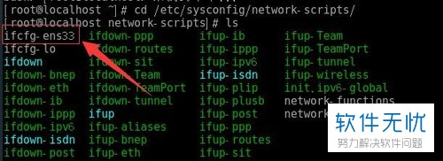
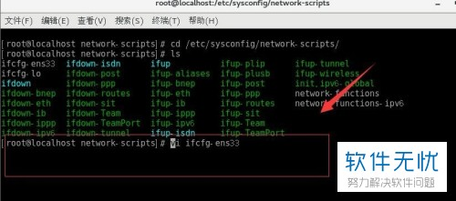
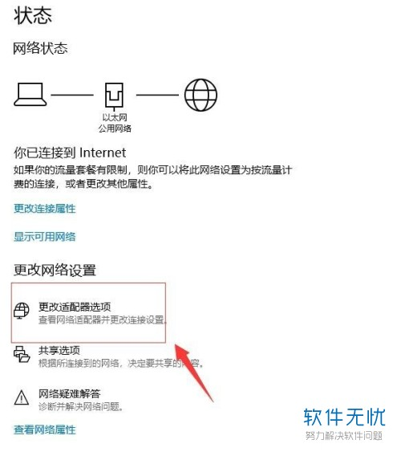

## 步骤一：设置系统的网络配置类型

1. 1.首先打开虚拟机，选择安装好的系统，点击下图所示“编辑虚拟机设置”选项：

   

2. \2. 然后就进入了虚拟机设置界面，如下图所示，点击箭头所指的“网络适配器”选项：

   

3. \3. 在网络适配器选项右侧板块可以看到有NAT模式一栏，选择该模式即可，点击页面最下方确定完成：

   

4. \4. 这边有些人也会选择“自定义——VM net 8（NAT模式）”，点击确定完成，如下图所示，小编认为测试一下应该远程的都可以连接上：

   

5. \5. 最后即可完成，进入下面第二步骤。

## 步骤二：查看虚拟机中的网段

1. \1. 第一步先打开虚拟机，在下图界面找到编辑栏，点击出现下拉界面，选择“虚拟网络编辑器”选项即可：

   

2. \2. 然后就进入了虚拟机网络配置界面，如下图所示：

   

3. \3. 在下图界面，找到箭头所指的“VM net 8”选项，选中即可：

   

4. \4. 在接下来的VM net信息界面找到“子网ip”选项，记住界面出现的IP地址即可：

   

5. \5. 接着在下图界面选择“NAT设置”，进入具体的设置界面，一般都是跟下图差不多的，具体的根据自己的IP地址来修改即可，注意的是需要在同一个IP段：

   

6. \6. 完成即可，接着进入下面的第三步骤。

## 步骤三：设置系统中的静态IP

1. \1. 第一步先进入系统，打开终端，如下图所示：

   

2. \2. 然后在终端下图红色箭头所指的地方输入：ip addr，回车，就可以看到下图界面了：

   

3. \3. 然后根据自己的IP地址进行修改输入下面命令：

   先输入[root@localhost ~]# cd /etc/sysconfig/network-scripts/，然后按住回车，再输入[root@localhost network-scripts]# ls，再次回车，如下图所示：

   

4. 4.这时在下图界面找到箭头所指的第一个文件的名字，用它打开配置：

   

5. \5. 再在终端输入：[root@localhost ~]# vi ifcfg-ens33（系统文件名称根据上面图片中显示的名称来输入，不一定就是这个名字），如下图所示：

   

6. \6. 按住回车键，就可以进入下图所示的ens33文件界面：

   

7. 7.然后在下图界面找到ONBOOT=no并且进行修改，改为ONBOOT=yes：

   

8. \8. 继续在该界面找到“BOOTPROTO=dhcp”并进行修改，改为“BOOTPROTO=static”static（这是静态地址的意思）：

   

9. \9. 继续在该界面的末尾添加上固定IP地址以及子网掩码（IP地址、DNS、默认网关以及子网掩码需要跟之前设置的在同一IP段内），具体见下：

   IPADDR=192.168.249.88

   NETMASK=255.255.255.0

   PREFIX=24

   GATEWAY=192.168.249.2

   DNS1=114.114.114.114

   ）：

   

10. 10.这边来看一下具体的修改步骤：首先把鼠标光标移到需要修改的地方，然后按小写字母“i”进入编辑模式，接着按住“Esc”退出当前的编辑模式，继续按住shift+w+q，这时会在终端出现“entering ex mode.....”，在下面那行的冒号后面继续输入：wq，按住回车键选择退出，如下图所示：

    

11. \11. 以上就可以完成系统中的静态IP设置了，下面就可以进行虚拟机的IP地址的配置了。

## 步骤四：配置虚拟机的IP

1. \1. 第一步先在下图所示界面右下角找到“网络显示图标”，点击：

   

2. \2. 然后点击选择弹出框的“打开网络与共享中心”，如下图所示：

   

3. 3.接着可以看到弹出下图“网络状态”界面，在这个界面找到“更改适配器设置”选项即可：

   

4. \4. 然后就可以进入下图所示网络连接界面，选择箭头所指的“VMware Network Adapter VMnet8”：

   

5. \5. 然后右击，会出现下图的对话框，选中“属性”即可：

   

6. \6. 继续在VMware Network Adapter VMnet8属性中，找到“Internet 协议版本4（TCP/IPv4）”选项，点击，再选择下图下面的红色箭头所指的“属性”即可：

   

7. 7.这时就进入了IP地址设置界面，如下图所示：（备注：下图中的ip地址设置要跟步骤三设置的IP地址不一样，是为了防止冲突不能访问，但是需要注意的是这个需要在同一个IP段内）

   

8. \8. 最后完成，点击确定退出即可：

   

9. \9. 完成设置，接着看下面的第五步骤。

## 步骤五：xshell连接Linux

1. \1. 首先打开上面安装好的xshell，新建一个会话，在下图所示红色框出的主机位置输入上面我们在centos设置好的IP地址（可以看一下上面第三步骤的IP地址），最后点击“连接”即可：

   

2. \2. 然后会跳出下图所示的对话框，输入登陆的用户名，点击确定即可完成：

   

3. \3. 这时还会跳出下图所示身份验证的对话框，在里面输入登录的用户名（即安装系统时设置好的账户密码），最后点击确定即可完成：

   

4. \4. 等待系统连接上centos系统即可成连接，如下图所示：

   

5. \5. 以上就是VMware虚拟机安装centos7使用xshell连接访问的具体操作步骤分享过程。