## 一、Solr简介

### 1.1 Solr简介

`Solr`是Apache下的一个顶级开源项目，采用Java开发，它是**基于Lucene的全文搜索服务器**。Solr提供了比`Lucene`更为丰富的查询语言，同时实现了可配置、可扩展，并对索引、搜索性能进行了优化。

Solr **可以独立运行**，运行在**Jetty**、**Tomcat**等Servlet容器中。Solr不提供构建UI的功能，Solr提供了一个管理界面，通过管理界面可以查询Solr的配置和运行情况。

Solr索引的实现方法很简单，用`Post`方法向Solr服务器发送一个描述Field及其内容的JSON文档，Solr根据JSON文档**添加**、**删除**、**更新**索引。Solr搜索只需发送`Get`请求，然后对Solr返回的JSON等格式的**查询**结果进行解析，组织页面布局。

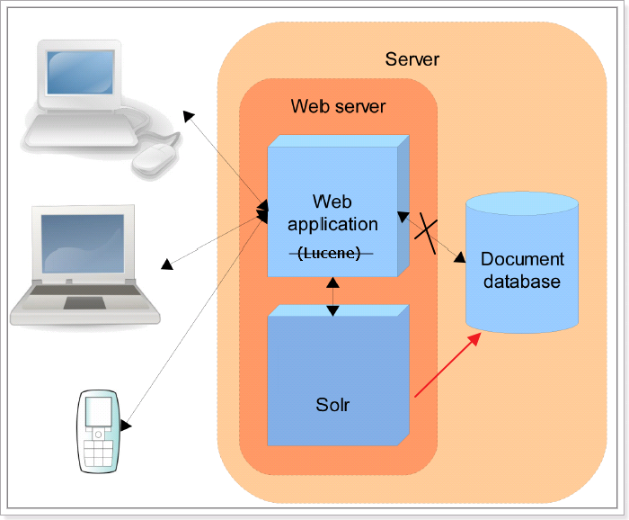

### 1.2 Solr与Lucene区别

`Lucene`是一个开放源代码的全文检索引擎工具包，它**不是一个完整的全文检索引擎**，Lucene提供了完整的查询引擎和索引引擎，目的是**为开发人员提供一个简单易用的工具包**，以方便在目标系统中实现全文检索的功能，或者以Lucene为基础构建全文检索引擎。

`Solr`目标是打造一款**企业级的搜索引擎系统**，它是一个**搜索引擎服务**，可以独立运行，通过Solr可以非常快速的构建企业的搜索引擎。

## 二、Solr安装与配置

### 2.1 下载Solr

安装Solr前先要安装好`JAVA`和`Tomcat`，我使用的版本如下：

- JDK 1.8
- Tomcat 8.5

Solr下载地址[点击这里](https://mirrors.aliyun.com/apache/lucene/solr/)，我使用的版本是`solr-6.6.5`

下载完后，解压压缩包，目录结构如下： 

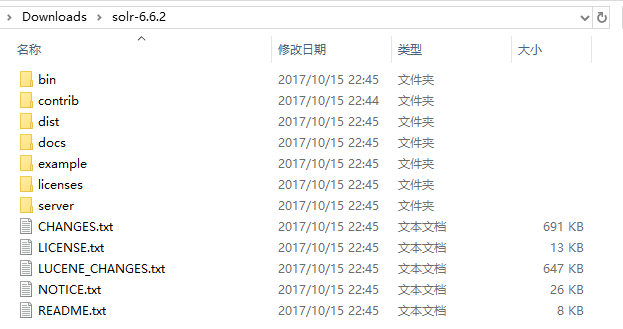

| 名称                | 介绍                              |
| ------------------- | --------------------------------- |
| bin                 | Solr的脚本启动目录                |
| contrib             | 关于solr的第三方扩展              |
| dist                | Solr的核心JAR包和扩展JAR包        |
| dist/solrj-lib      | 构建基于Solr的客户端时用到的JAR包 |
| dist/test-framework | 包含测试Solr时候用到的JAR包       |
| docs                | Solr文档                          |
| example             | Solr的简单示例                    |
| licenses            | 许可协议                          |
| server              | 本地运行Solr的必要文件            |

### 2.2 搭建Solr后台

Solr自带了一个后台管理，但是不能直接运行，需要进行配置。

在配置前，先说明下我的Tomcat安装位于`D:\apache-tomcat-8.5.16`，下载的solr源码包名称为`solr-6.6.2`，后面的步骤使用到的目录请根据个人实际情况进行修改。

**Step1：**将`solr-6.6.2\server\solr-webapp`下的`webapp`复制到`D:\apache-tomcat-8.5.16\webapps`目录下，并改名为`solr`（名称任意）。 
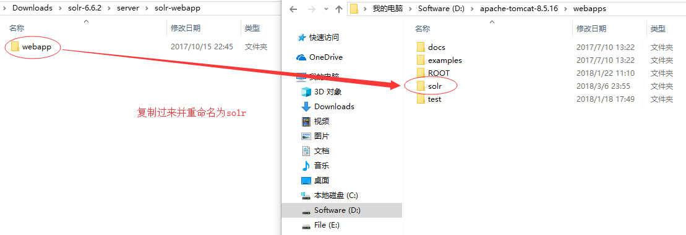

**Step2：** 将`solr-6.6.2\server\lib\ext`的jar包复制到`D:\apache-tomcat-8.5.16\webapps\solr\WEB-INF\lib`目录下。 
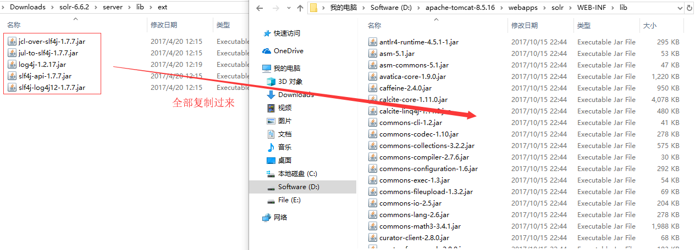

**Step3：**将`solr-6.6.2\dist`下的`solr-dataimporthandler-6.6.2.jar`和`solr-dataimporthandler-extras-6.6.2.jar`复制到`D:\apache-tomcat-8.5.16\webapps\solr\WEB-INF\lib`目录下。 
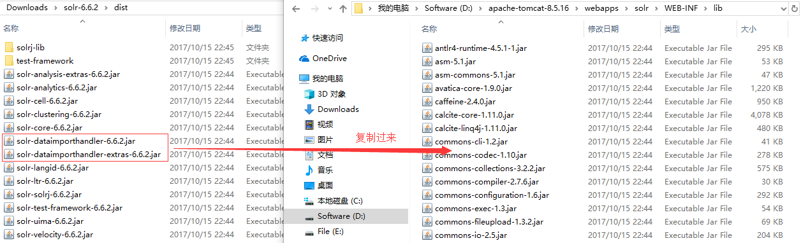

**Step4：**将`solr-6.6.2\server\lib`下的以`metrics`开头的5个jar包复制到`D:\apache-tomcat-8.5.16\webapps\solr\WEB-INF\lib`目录下。 
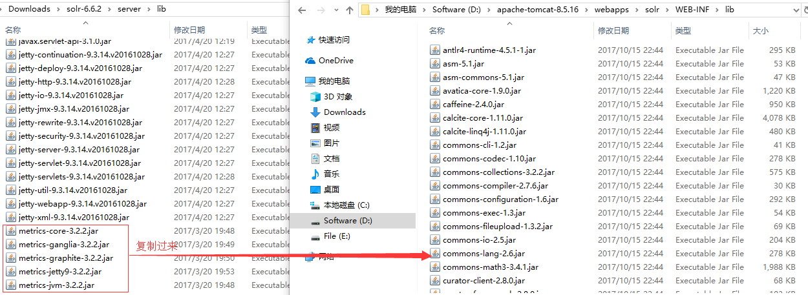

**Step5：** 配置solr的家目录。在E盘下创建文件夹`solrHome`（位置名称任意），将`solr-6.6.2\server\solr`下的所有文件复制到`E:\solrHome`。 
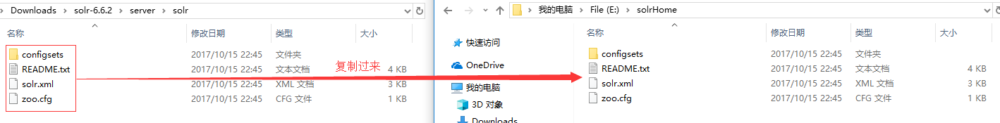

**Step6：**修改solr配置文件。打开`D:\apache-tomcat-8.5.16\webapps\solr\WEB-INF`下的`web.xml`，定位到40行，将下面一段注解打开，并修改`<env-entry-value>`值为`E:/solrHome`。 
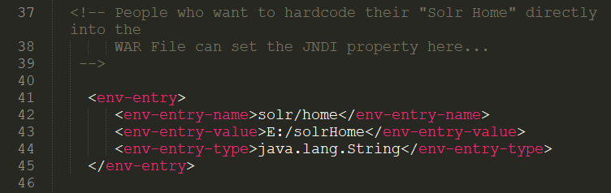

**Step7：**将`web.xml`168行那一大块注释掉，不然访问solr会出现没有授权的错误。 
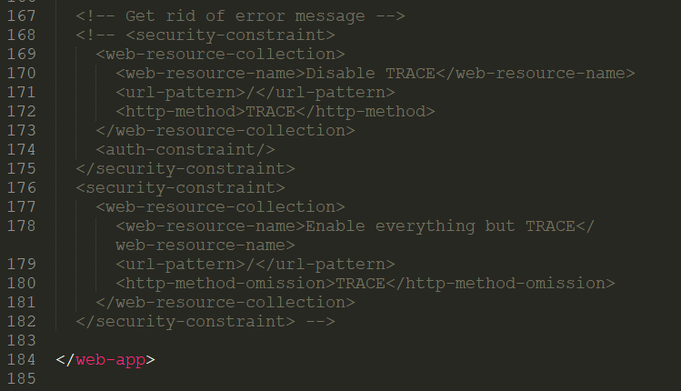

**Step8：** 在`D:\apache-tomcat-8.5.16\webapps\solr\WEB-INF`目录下创建`classes`文件夹，并将`solr-6.6.2\server\resources`下的`log4j.properties`复制过去。 
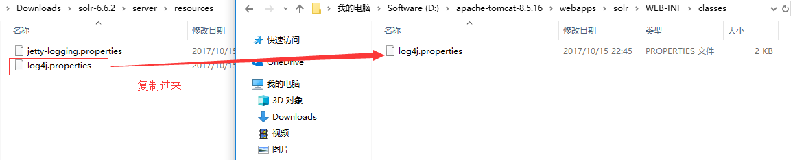

**Step9：**启动Tomcat，访问`http://localhost:8080/solr/index.html`，登陆到Solr后台管理。 
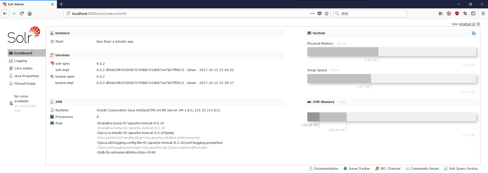

### 2.3 创建一个核(core)

现在为Solr添加一个`核（core）`，在`E:/solrHome`目录下新建一个文件夹，文件夹名就是核的名字，以`core1`为例。 
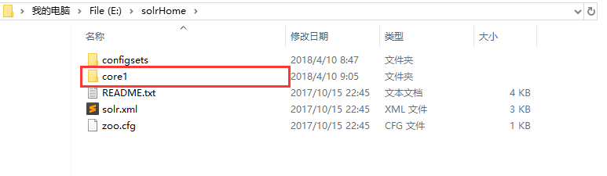

拷贝`E:\solrHome\configsets\sample_techproducts_configs`目录下的`conf`文件夹到`core1`文件夹中。 
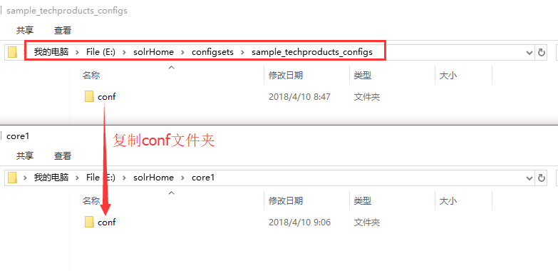

在Solr后台的`Core Admin`中点击`Add Core`新建一个核，`name`和`instanceDir`填之前建的文件夹名。 
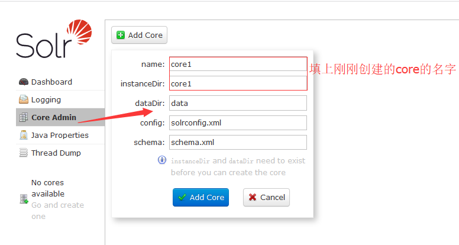

添加后多了一个`Core Seletctor`，至此核就建好了。 
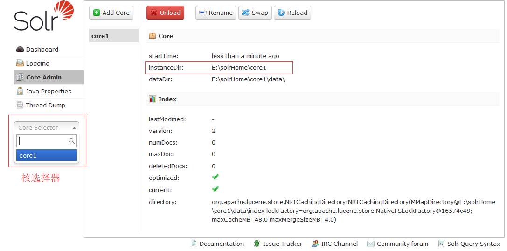

------

## 三、后台介绍

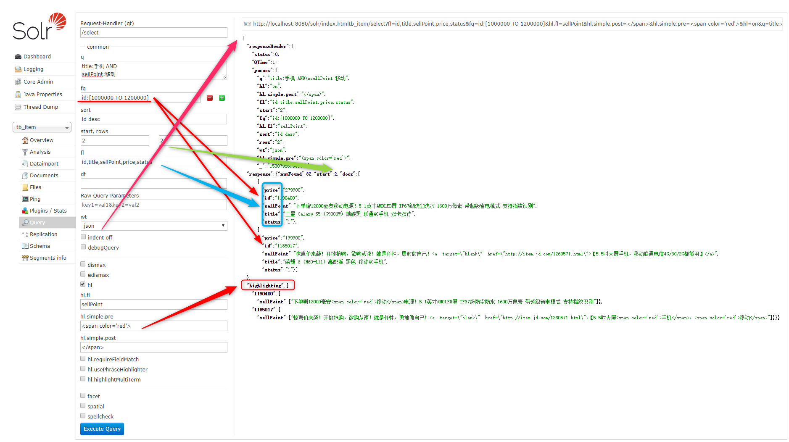

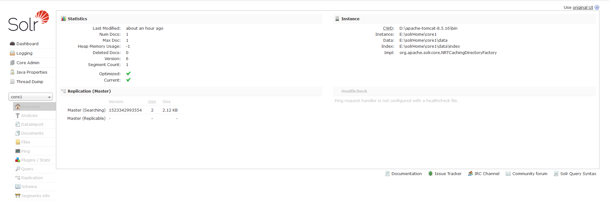


| 名称            | 含义                     |
| --------------- | ------------------------ |
| Dashboard       | 仪表盘，包含一些参数信息 |
| Logging         | 日志信息                 |
| Core Admin      | 核管理                   |
| Java Properties | Java、Tomcat参数信息     |
| Thread Dump     | 每次CRUD产生的进程日志   |

核的信息中：

| 名称             | 含义                                           |
| ---------------- | ---------------------------------------------- |
| Overview         | 核的参数信息                                   |
| Analysis         | 分词                                           |
| Dataimport       | 数据导入，能够从数据库中将表等信息导入索引库中 |
| Documents        | 对文档Document进行增、删、改操作               |
| Files            | 显示核的conf目录下所有内容                     |
| Ping             | 测试与主机的ping值                             |
| Plugins / Status | 插件                                           |
| Query            | 对文档Document进行查询操作                     |
| Replication      | 副本，用于备份机                               |
| Schema           | 域配置                                         |

## 四、配置IK分词器

Solr配置第三方分词器也是十分简单，这里以IK分词器为例。[点击下载](https://download.csdn.net/download/yuanlaijike/10270713)我自编译的`IK分词器`，支持到 JDK 1.8 + Lucene 6.6.2。

**Step1：** 将`IK分词器`的jar包放到`D:\apache-tomcat-8.5.16\webapps\solr\WEB-INF\lib`目录下。 
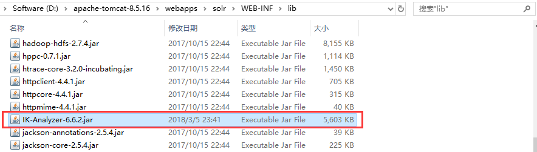

**Step2：**将IK分词器的配置文件放到`D:\apache-tomcat-8.5.16\webapps\solr\WEB-INF\classes`文件夹下，文件夹如果不存在手动创建： 
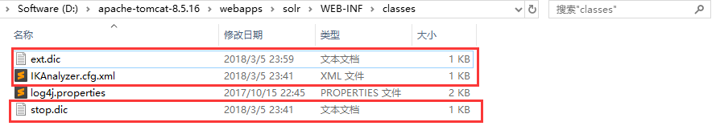

**Step3：** 在`managed-schema`配置文件中添加IK分词器的类型，以及创建使用IK分词器的域：

```xml
<!-- IK分词器 -->
<fieldType name="text_ik" class="solr.TextField">
    <analyzer class="org.wltea.analyzer.lucene.IKAnalyzer"/>
</fieldType>

<!-- IK分词器的域 -->
<field name="title_ik" type="text_ik" indexed="true" stored="true" />
<field name="content_ik" type="text_ik" indexed="true" stored="false" multiValued="true"/>
```

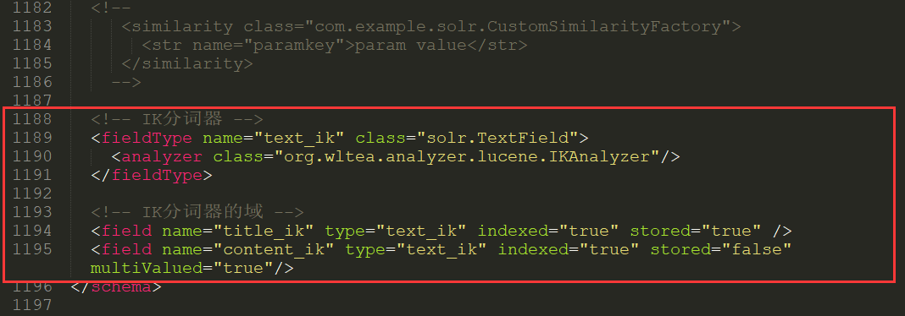

**Step4：** 重新启动Solr服务，测试一下IK分词器的效果：

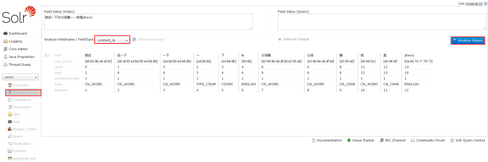

## 五、Document的增删改查

进入Solr后台页面，选择一个核，点击`Documents`，进入`Document`管理标签： 
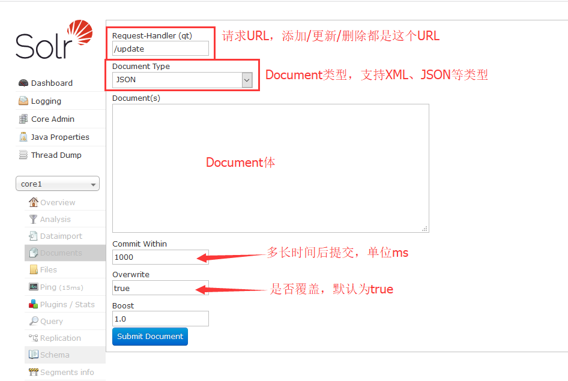

###1、添加Document

在上文已经说过了，id是一个Document必须要包含的field，让我们新建一个`Document`，类型为`JSON`：

```
{
"id" : 1,
"name" : "jitwxs"
}1234
```

在查询页中点击`Execute Query`进行查询，就能看见我们添加的这个`Doucment`了：

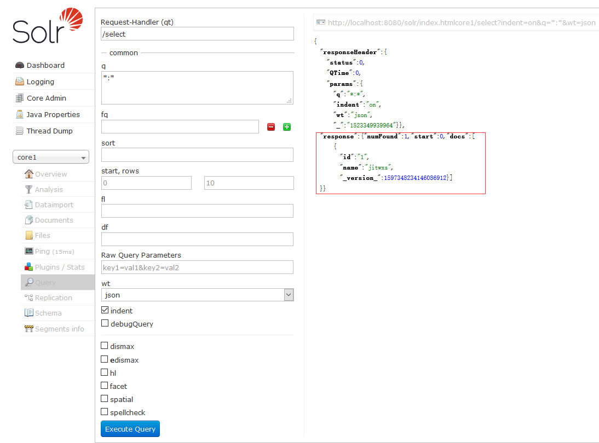

###2、更新Document

修改一个`Document`十分简单，只需要指定`id`，Solr就会先删除id为指定id的`Document`，然后将我们输入的`Document`保存起来，达到更新的目的（内部实现是**先删后添**）。

当我们输入：

```
{
"id" : 1,
"author":"jitwxs",
"content" : "哇哈哈哈"
}12345
```

重新查询：

```
{
  "responseHeader":{
    "status":0,
    "QTime":0,
    "params":{
      "q":"*:*",
      "indent":"on",
      "wt":"json",
      "_":"1523349939964"}},
  "response":{"numFound":1,"start":0,"docs":[
      {
        "id":"1",
        "author":"jitwxs",
        "author_s":"jitwxs",
        "content":["哇哈哈哈"],
        "_version_":1597348563073892352}]
  }}1234567891011121314151617
```

###3、删除Document

删除一个`Document`比较特殊，使用`JSON`无法实现，我们将`Document`类型修改为`XML`，将id为1的Document删除掉：

```
<delete>
    <id>1</id>
</delete>123
```

重新查询：

```
{
  "responseHeader":{
    "status":0,
    "QTime":1,
    "params":{
      "q":"*:*",
      "indent":"on",
      "wt":"json",
      "_":"1523349939964"}},
  "response":{"numFound":0,"start":0,"docs":[]
  }1234567891011
```

除了上面哪种方法，还可以指定删除条件：

```
<delete>
    <query>id:1</query>
</delete>123
```

因为可以始用正则表达式，那么举一反三，删除所有Document，就是：

```
<delete>
    <query>*:* </query>
</delete>123
```

###4、导入数据

**Step1：导入依赖包**

在`core1`的目录下新建`lib`文件夹（如果有，无需建立），从Solr源码包的dist文件夹中导入两个`solr-dataimporthandler`包，以及一个`mysql`驱动包。

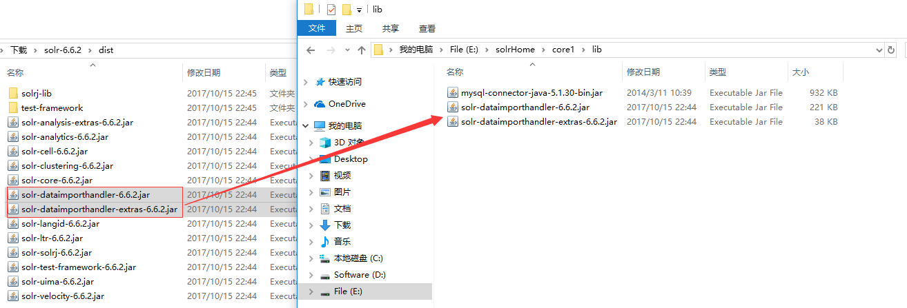

**Step2：创建导入数据的Handler**

编辑`core1/conf`目录下的`solrconfig.xml`文件，在文件末尾添加上对`requestHander`的配置：

```xml
<requestHandler name="/dataimport" class="org.apache.solr.handler.dataimport.DataImportHandler">
    <lst name="defaults">
        <str name="config">data-config.xml</str>
    </lst>
</requestHandler>12345
```

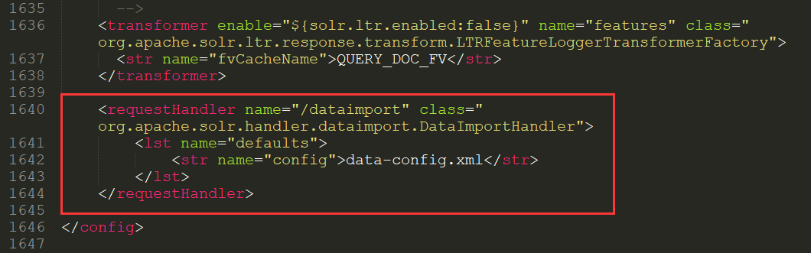

**Step3：配置data-config.xml**

我们刚刚在`requestHander`中指定了我们数据导入的配置文件，因此我们在`solrconfig.xml`的同级目录下，即`core1/conf`目录下新建`data-config.xml`文件： 
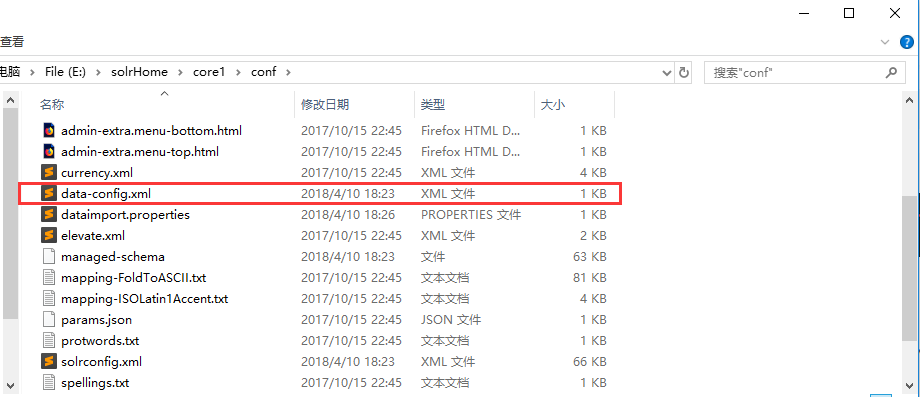

编辑文件内容：

```xml
<?xml version="1.0" encoding="UTF-8" ?>

<dataConfig>
    <!-- 数据库信息 -->
    <dataSource type="JdbcDataSource" 
        driver="com.mysql.jdbc.Driver" 
        url="jdbc:mysql://localhost:3306/cgpt" 
        user="root" password="root"/>
    <document>
        <!-- document实体 -->
        <entity name="item" query="SELECT id,title,sell_point,price FROM tb_item">
            <!-- 数据库字段映射solr字段 -->
            <field column="id" name="id"/>
            <field column="title" name="item_title"/>
            <field column="sell_point" name="item_sell_point"/>
            <field column="price" name="item_price"/>
        </entity>
    </document>
</dataConfig>
```

配置文件总共两个部分，第一个部分是数据库连接信息，第二个部分是在`document`中建立了一个实体，参数一个是name，一个是sql查询语句，其内部对查询结果的**每一项映射Solr的field**。

**Step4：配置field**

在上一步中，我们将查询结果的每一项映射到了Solr的`filed`的上，但是除了`id`是存在的以外，其他都不存在，因此我们需要手动添加。

编辑`managed-schema`文件，在末尾新增相关的field.

（1）创建了`item_title`、`item_sell_point`、`item_price`三个域，其中前两个类型为IK分词器的类型，第三个为int类型。

（2）创建了`item_keywords`域，将`item_title`、`item_sell_point`拷贝到`item_keywords`中，便于搜索。（因为需求是从商品标题或商品卖点中查找）

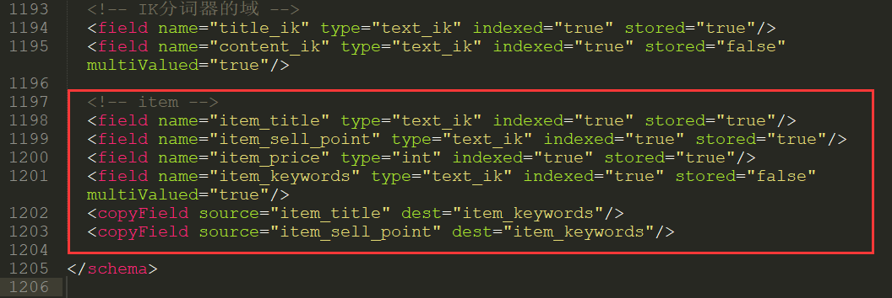

**Step5：重启服务**

重启服务，选择`core1`的`Dataimport`标签页，此时右边就已经有内容了。 
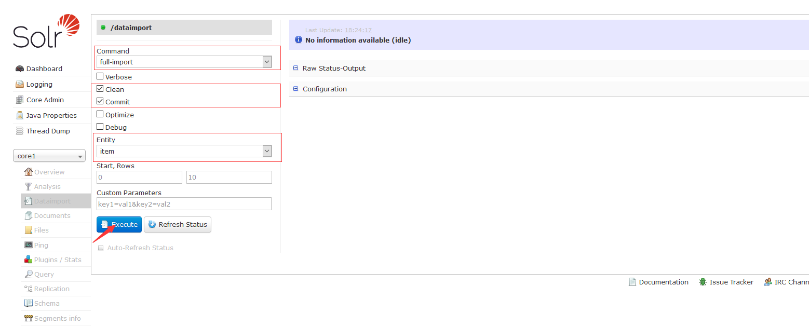

解释：

（1）`/dataimport`

第二步`requestHandler`中起的名字。

（2）`clean`

每次导入前，清空Document。

（3）`Entity`

第三步`data-config.xml`中配置的`entity`。

当我们点击Execute按钮后，过一会右边会提示索引创建成功，如下所示： 
 

点击`Query`标签页，查询后可以看到数据已经被导入了： 
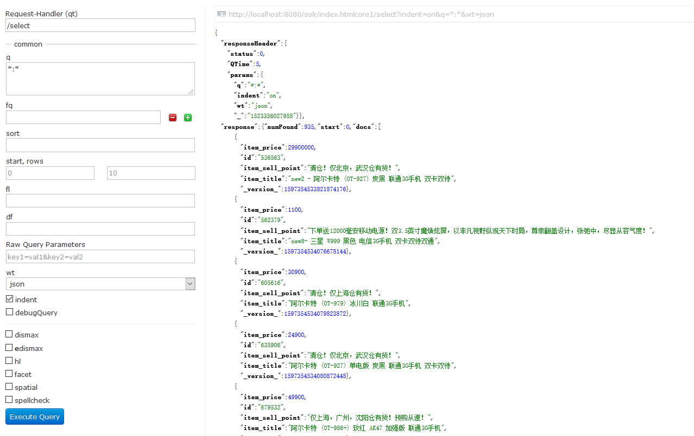

###5、查询Document

之前一直是用`*.*`查询所有，下面详细介绍下查询：

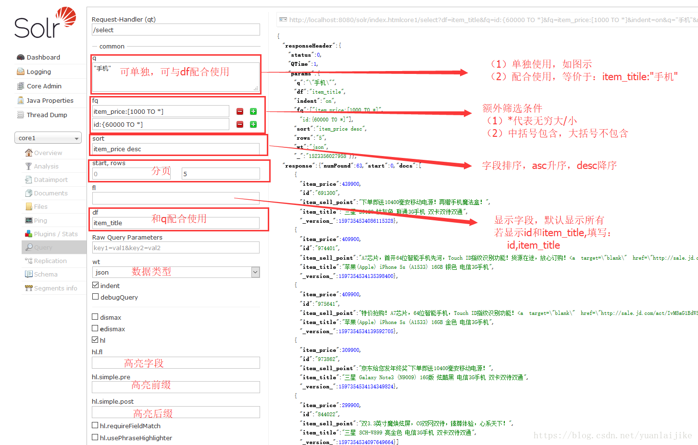

## 六、基本SolrJ的基本使用

###导入依赖

导入Solr源码包`dist`文件夹下的`solr-solrj-6.6.2.jar`以及`solrj-lib`文件夹下的所有包到项目中。除此之外，还要加上`log4j`包和`junit`测试包。

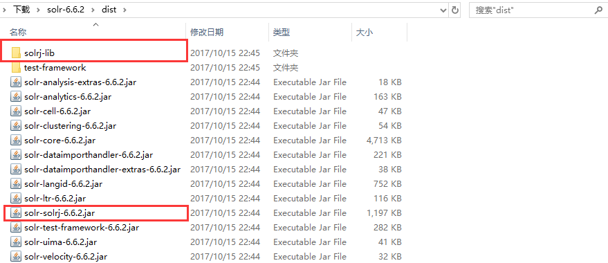

###添加/更新数据

Solrj的使用十分简单，下面是一个添加数据的例子：

```java
@Test
public void testAdd() throws Exception {
    // 指定url
    String baseURL = "http://localhost:8080/solr/core1";

    // 1.创建Solr单机版客户端
    HttpSolrClient solrClient = new HttpSolrClient(baseURL);

    // 2.创建一个Document
    SolrInputDocument doc = new SolrInputDocument();
    doc.addField("id", "10086");
    doc.addField("author", "jitwxs");
    // 3.添加Document，1000ms自动提交
    solrClient.add(doc, 1000);
}
```

（1）BaseURL就是Solr的首页地址和核： 
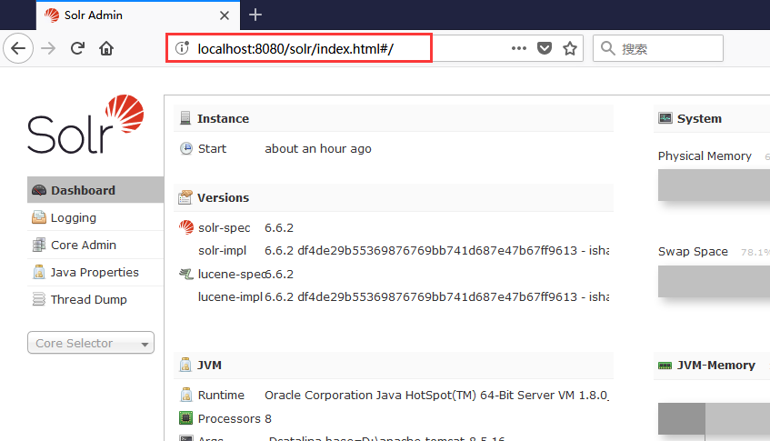

（2）创建一个`SolrClient`，其中`HttpSolrClient`是单机版，`CloudSolrClient`是集群版。

（3）可以设置提交时间自动提交，也可以手动提交`solrClient.commit();`

（4）这种初始化`SolrClient`的方式在`Solr 7.0`中被废弃，改为：

```java
HttpSolrClient solrClient = new HttpSolrClient.Builder(BASE_URL)
                .withConnectionTimeout(10000)
                .withSocketTimeout(60000)
                .build();1234
```

查看Solr后台，发现数据已经被添加了： 
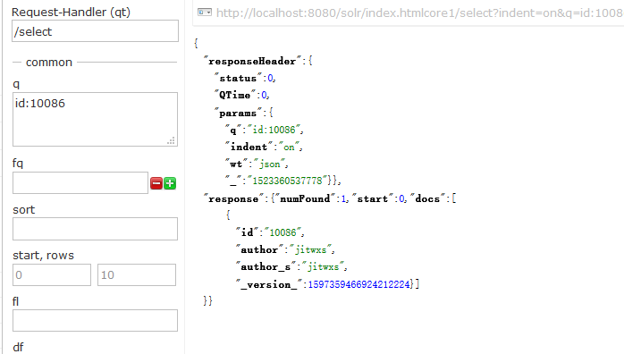

###删除数据

删除十分简单，不再具体演示，给出相关API：

```java
// 根据id删除单个
solrClient.deleteById("10086");

// 根据id删除多个
List<String> ids = new ArrayList<>();
ids.add("1");
solrClient.deleteById(ids, 1000);

// 根据条件删
solrClient.deleteByQuery("*:*");

// 根据条件删，指定核
solrClient.deleteByQuery("core1", "id:10086", 1000);
```

###查询数据

业务需求：

- 默认域为item_title
- 关键词：手机
- 价格：5k以上
- 价格降序
- 分页：第1页，每页10条
- 高亮：红色

```java
@Test
public void testQuery() throws Exception {
    // 指定Solr服务器url
    String baseURL = "http://localhost:8080/solr/core1";

    // 创建Solr单机版客户端
    SolrClient HttpSolrClient = new HttpSolrClient(baseURL);

    /*
     * 查询需求
     * 设置默认域为item_title
     * 关键词：手机
     * 价格：5k以上
     * 排序：价格降序
     * 分页：第1页，每页10条
     * 高亮：红色
     */
    SolrQuery solrQuery = new SolrQuery();
    // 设置默认域
    solrQuery.set("df", "item_title");
    // 设置关键词
    solrQuery.set("q", "手机");
    // 设置价格区间
    solrQuery.set("fq", "item_price:[5000 TO *]");
    // 设置排序
    solrQuery.addSort("item_price", ORDER.desc);
    // 设置分页
    solrQuery.setStart(1);
    solrQuery.setRows(5);
    // 开启高亮
    solrQuery.setHighlight(true);
    // 设置高亮字段
    solrQuery.addHighlightField("item_title");
    // 高亮前缀
    solrQuery.setHighlightSimplePre("<span style='color:red'>");
    // 高亮后缀
    solrQuery.setHighlightSimplePost("</span>");

    // 执行查询
    QueryResponse response = solrClient.query(solrQuery);
    // 获取文档结果集
    SolrDocumentList docs = response.getResults();
    // 获取高亮结果集
    Map<String, Map<String, List<String>>> highlighting = response.getHighlighting();

    // 总条数
    long numFound = docs.getNumFound();
    System.out.println("共查到：" + numFound + "条数据");

    for(SolrDocument doc : docs) {
        System.out.println("id:" + doc.get("id"));
        System.out.println("sell_point:" +doc.get("item_sell_point"));
        System.out.println("price:" +doc.get("item_price"));

        // 标题高亮
        Map<String, List<String>> map = highlighting.get(doc.get("id"));
        List<String> list = map.get("item_title");
        for(String s : list) {
            System.out.println("title:" + s);
        }

        System.out.println("==================");
    }
}
```

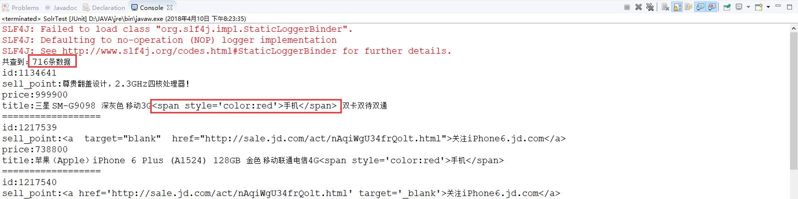


## 七、一些配置文件的说明

###solrconfig.xml

solrconfig.xml是solr Core的启动配置文件。


在文件中配置了jar包，以及da-data-config.xml文件的位置。


###db-data-config.xml说明

```xml
<dataConfig>
	<dataSource
			type="JdbcDataSource"
			driver="com.mysql.jdbc.Driver"
			url="jdbc:mysql://127.0.0.1:3306/CGPT"
			user="root"
			password="root" />
	<document>
		<entity name="product"
				query="SELECT
					BEAN.ID AS ID,
					BEAN.MAT_NAME AS MAT_NAME,
					BEAN.PARENT_NAME AS PARENT_NAME,
					BEAN.PRO_NAME AS PRO_NAME,
					BEAN.PRO_IMG AS PRO_IMG,
					BEAN.PRO_NUM AS PRO_NUM
					FROM tcz_supplier_product BEAN
					WHERE 1=1
					AND BEAN.PRO_IMG IS NOT NULL
					AND BEAN.PRO_IMG !=''
		 			limit ${dataimporter.request.start_row},${dataimporter.request.page_size} "
				deltaImportQuery="select * from solr_article where noid=${dih.delta.noid}"
				deltaQuery="select noid from solr_article where update_date > '${dataimporter.updateDate}'"
				transformer="RegexTransformer">

			<!--field中存在的column需要与schema.xml中field的name对应-->
			<field column="ID" name="id" />
			<field column="PRO_NAME" name="pro_name" />
			<field column="MAT_NAME" name="mat_name" />
			<field column="PARENT_NAME" name="parent_name" />
			<field column="PRO_IMG" name="pro_img" />
			<field column="PRO_NUM" name="pro_num" />

            <entity name="product_type"
                    query="SELECT ID,NAME
                         FROM tcz_supplier_product_type
                         WHERE NAME IS NOT NULL">
                <field column="ID" name="pro_id" />
                <field column="NAME" name="mat_type_name" />
            </entity>
		</entity>
	</document>
</dataConfig>

```

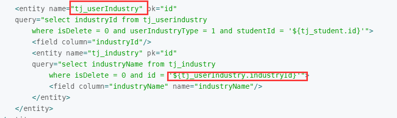

###schema.xml中配置详解

简单的一个schema.xml ,这里的field的name要跟以上db-data-config.xml的field的name对应。

```xml
<?xml version="1.0" encoding="UTF-8" ?>
<schema name="product" version="1.6">
	<types>
		<fieldType name="string" class="solr.StrField"
				   sortMissingLast="true" omitNorms="true" />
		<fieldType name="boolean" class="solr.BoolField"
				   sortMissingLast="true" omitNorms="true" />
		<fieldType name="int" class="solr.TrieIntField" omitNorms="true" />
		<fieldType name="long" class="solr.TrieLongField" omitNorms="true" />
		<fieldType name="float" class="solr.TrieFloatField" omitNorms="true" />
		<fieldType name="double" class="solr.TrieDoubleField" omitNorms="true" />
		<fieldType name="date" class="solr.TrieDateField" sortMissingLast="true" omitNorms="true" />
		<!--中文分词器-->
		<fieldType name="text" class="solr.TextField">
			<analyzer class="org.wltea.analyzer.lucene.IKAnalyzer" />
		</fieldType>
	</types>
	<fields>
		<!--indexed：是否被索引，只有设置为true的字段才能进行搜索排序分片(earchable, sortable, facetable)。-->
		<!--stored：是否存储内容，如果不需要存储字段值，尽量设置为false以提高效率。-->
		<!--multiValued：是否为多值类型，SOLR允许配置多个数据源字段存储到一个搜索字段中。多个值必须为true，否则有可能抛出异常。-->
		<field name="_version_" type="long" indexed="true" stored="true"/>
		<field name="id" type="string" indexed="true" stored="true" required="true" />
		<field name="mat_name" type="string" indexed="true" stored="true" required="false" />
		<field name="parent_name" type="string" indexed="true" stored="true" required="false" />
		<field name="pro_img" type="string" indexed="true" stored="true" required="false" />
		<field name="pro_num" type="int" indexed="true" stored="true" required="false" />
		<field name="pro_name" type="string" indexed="true" stored="true" required="false" />
		<field name="search" type="text" indexed="true" stored="false" required="true" multiValued="true"/>

		<copyField source="pro_name" dest="search" />
		<copyField source="parent_name" dest="search" />
		<copyField source="mat_name" dest="search" />
		<copyField source="pro_num" dest="search" />

		<field name="pro_id" type="string" indexed="true" stored="true" required="false" />
		<field name="mat_type_name" type="string" indexed="true" stored="true" required="false" />
		<!--dynamicField:用通配符定义一个field来存在没有被field定义的漏网之鱼-->
		<dynamicField name="*_PROP" type="string" indexed="true" stored="true" />
		<dynamicField name="*_prop" type="string" indexed="true" stored="true" />

	</fields>

	<uniqueKey>id</uniqueKey>
	<!--defaultSearchField:默认搜索的字段。-->
	<defaultSearchField>search</defaultSearchField>
	<solrQueryParser defaultOperator="AND" />
</schema>


```

详解

```xml
<?xml version="1.0" encoding="UTF-8" ?>
<!--
 版权说明。。.
-->
<!--  
 这是solr的chema 文件，这个文件应该名为"schema.xml",而且他应该放在solrhome/core/conf文件下面。
 获取你也能在solr webapp 的classload下面找到他.
 更多的信息可以查看
 http://wiki.apache.org/solr/SchemaXml
 性能说明:可以如下来提高性能。
  - 设置 stored="false" 对那些只需要搜索，无需返回的字段.
  - 设置 indexed="false" 对于那些只用于返回无需进行搜索的字段.
  - 删除所有不需要 copyfiled字段的声明
  - 为了最好的索引大小与索引性能，设置所有一般的文本字段index=false,使用copyfile将他们copy到一个字段上，然后使用它进行搜索。
  - 运行jvm服务器模式，并使用较高的日志级别，避免记录每一个请求。
-->

<schema name="example-data-driven-schema" version="1.6">
<!-- 该配置名称与版本说明.-->
<!-- 字段的有效属性:

name：属性的名称，这里有个特殊的属性“_version_”是必须添加的。
type：字段的数据结构类型，所用到的类型需要在fieldType中设置。
default：默认值。
indexed：是否创建索引
stored：是否存储原始数据（如果不需要存储相应字段值，尽量设为false）
docValues：表示此域是否需要添加一个 docValues 域，这对 facet 查询， group 分组，排序， function 查询有好处，尽管这个属性不是必须的，但他能加快索引数据加载，对 NRT 近实时搜索比较友好，且更节省内存，但它也有一些限制，比如当前docValues 域只支持 strField,UUIDField,Trie*Field 等域，且要求域的域值是单值不能是多值域
solrMissingFirst/solrMissingLast：查询结果排序的过程中，如果发现这个字段的值不存在，则排在前面/后面，忽略排序的条件
multValued：是否有多个值，比如说一个用户的所有好友id。（对可能存在多值的字段尽量设置为true，避免建索引时抛出错误）
omitNorms：此属性若设置为 true ，即表示将忽略域值的长度标准化，忽略在索引过程中对当前域的权重设置，且会节省内存。只有全文本域或者你需要在索引创建过程中设置域的权重时才需要把这个值设为 false, 对于基本数据类型且不分词的域如intFeild,longField,Stre, 否则默认就是 false.
required：添加文档时，该字段必须存在，类似mysql的not null
termVectors: 设置为 true 即表示需要为该 field 存储项向量信息，当你需要MoreLikeThis 功能时，则需要将此属性值设为 true ，这样会带来一些性能提升。
termPositions: 是否存储 Term 的起始位置信息，这会增大索引的体积，但高亮功能需要依赖此项设置，否则无法高亮
termOffsets: 表示是否存储索引的位置偏移量，高亮功能需要此项配置，当你使用SpanQuery 时，此项配置会影响匹配的结果集

-->

<!--字段名称应该包含字母数字或下划线字符，不以一个数字开始。这是目前没有严格执行，但其他字段名称将不会有来自所有组件的第一类支持和背部的兼容性没有保证。领导和的名字下划线（如_version_）保留。-->
<!--
在这data_driven_schema_configs configset，下面三个字段是必须的：
id、_version_，和_text_。所有其他字段都是可以删除修改的，并根据需要手动添加
在xml。
请注意，许多动态字段也被定义-您可以使用它们来指定一个
字段的类型通过字段命名约定-见下文。
警告：本_text_catch所字段将会显著地提高索引的大小。
如果你不需要，考虑删除它和相应的copyfield指令。-->
    <field name="id" type="long" indexed="true" stored="true" required="true"/>
    <!-- 常规字段->
    <field name="informer_id" type="long" indexed="true" stored="false"/>
    <field name="phone_number" type="string" indexed="true" stored="false"/>

    <field name="title" type="string" indexed="true" stored="true" />
    <field name="content" type="string" indexed="true" stored="true" />
    <field name="latitude" type="string" indexed="true" stored="true" />
    <field name="longitude" type="string" indexed="true" stored="true" />
    <field name="attachment" type="string" indexed="true" stored="true" />

    <field name="clue_status" type="int" indexed="true" stored="true" />
    <field name="del_flag" type="int" indexed="true" stored="true" />
    <field name="gmt_create" type="date" indexed="true" stored="true" />
    <field name="create_uid" type="long" indexed="true" stored="true" />
    <field name="gmt_modified" type="date" indexed="true" stored="true" />
    <field name="modified_uid" type="long" indexed="true" stored="true" />
    <!--预留字段 -->
    <!--<field name="id" type="string" indexed="true" stored="true"  multiValued="false" />-->
    <field name="_version_" type="long" indexed="true" stored="false"/>
    <field name="_root_" type="string" indexed="true" stored="false" docValues="false" />
    <field name="_text_" type="text_general" indexed="true" stored="false" multiValued="true"/>

    <!--复制字段-->
    <!--建议建立一个拷贝字段，将所有的 全文本 字段复制到一个字段中，以便进行统一的检索
        要注意的是，如果你只是复制单个域，那么如果你被复制域本身就是多值域，那么目标域也是多值域，这毋庸置疑，那如果你复制的是多个域，只要其中有一个域是多值域，那么目标域就一定是多值域，这点一定要谨记
    -->
    <copyField source="*" dest="_text_"/>

    <!--动态字段-->
    <!-- 动态字段 属性配置上与常规字段没啥区别，最大的区别是name的属性上可以进行通配，比如说name="*_i"，那么只要是后面带i的字段都是符合的。这样就不怕一些字段无法匹配无法写入  -->
   
    <dynamicField name="*_i"  type="int"    indexed="true"  stored="true"/>
    <dynamicField name="*_is" type="ints"    indexed="true"  stored="true"/>
    <dynamicField name="*_s"  type="string"  indexed="true"  stored="true" />
    <dynamicField name="*_ss" type="strings"  indexed="true"  stored="true"/>
    <dynamicField name="*_l"  type="long"   indexed="true"  stored="true"/>
    <dynamicField name="*_ls" type="longs"   indexed="true"  stored="true"/>
    <dynamicField name="*_t"   type="text_general" indexed="true" stored="true"/>
    <dynamicField name="*_txt" type="text_general" indexed="true" stored="true"/>
    <dynamicField name="*_b"  type="boolean" indexed="true" stored="true"/>
    <dynamicField name="*_bs" type="booleans" indexed="true" stored="true"/>
    <dynamicField name="*_f"  type="float"  indexed="true"  stored="true"/>
    <dynamicField name="*_fs" type="floats"  indexed="true"  stored="true"/>
    <dynamicField name="*_d"  type="double" indexed="true"  stored="true"/>
    <dynamicField name="*_ds" type="doubles" indexed="true"  stored="true"/>

    <!-- 字段类型 -->
    <!--
StrField: 这是一个不分词的字符串域，它支持 docValues 域，但当为其添加了docValues 域，则要求只能是单值域且该域必须存在或者该域有默认值
BoolField ： boolean 域，对应 true/false
TrieIntField, TrieFloatField, TrieLongField, TrieDoubleField 这几个都是默认的数字域， precisionStep 属性一般用于数字范围查询， precisionStep 值越小，则索引时该域的域值分出的 token 个数越多，会增大硬盘上索引的体积，但它会加快数字范围检索的响应速度， positionIncrementGap 属性表示如果当前域是多值域时，多个值之间的间距，单值域，设置此项无意义。
TrieDateField ：显然这是一个日期域类型，不过遗憾的是它支持 1995-12-31T23:59:59Z 这种格式的日期，比较坑爹，为此我自定义了一个 TrieCNDateField 域类型，用于支持国人比较喜欢的 yyyy-MM-dd HH:mm:ss 格式的日期。源码请参见我的上一篇博客。
BinaryField ：经过 base64 编码的字符串域类型，即你需要把 binary 数据进行base64 编码才能被 solr 进行索引。
RandomSortField ：随机排序域类型，当你需要实现伪随机排序时，请使用此域类型。
TextField ：是用的最多的一种域类型，它需要进行分词，所以它一般需要配置分词器。至于具体它如何配置 IK 分词器，这里就不展开了-->
    <fieldType name="string" class="solr.StrField" sortMissingLast="true" docValues="true" />
    <fieldType name="strings" class="solr.StrField" sortMissingLast="true" multiValued="true" docValues="true" />
    <fieldType name="boolean" class="solr.BoolField" sortMissingLast="true"/>
    <fieldType name="booleans" class="solr.BoolField" sortMissingLast="true" multiValued="true"/>
    <fieldType name="int" class="solr.TrieIntField" docValues="true" precisionStep="0" positionIncrementGap="0"/>
    <fieldType name="float" class="solr.TrieFloatField" docValues="true" precisionStep="0" positionIncrementGap="0"/>
    <fieldType name="long" class="solr.TrieLongField" docValues="true" precisionStep="0" positionIncrementGap="0"/>
    <fieldType name="double" class="solr.TrieDoubleField" docValues="true" precisionStep="0" positionIncrementGap="0"/>

    <fieldType name="ints" class="solr.TrieIntField" docValues="true" precisionStep="0" positionIncrementGap="0" multiValued="true"/>
    <fieldType name="floats" class="solr.TrieFloatField" docValues="true" precisionStep="0" positionIncrementGap="0" multiValued="true"/>
    <fieldType name="longs" class="solr.TrieLongField" docValues="true" precisionStep="0" positionIncrementGap="0" multiValued="true"/>
    <fieldType name="doubles" class="solr.TrieDoubleField" docValues="true" precisionStep="0" positionIncrementGap="0" multiValued="true"/>

    <!--
     各个精度值
    -->
    <fieldType name="tint" class="solr.TrieIntField" docValues="true" precisionStep="8" positionIncrementGap="0"/>
    <fieldType name="tfloat" class="solr.TrieFloatField" docValues="true" precisionStep="8" positionIncrementGap="0"/>
    <fieldType name="tlong" class="solr.TrieLongField" docValues="true" precisionStep="8" positionIncrementGap="0"/>
    <fieldType name="tdouble" class="solr.TrieDoubleField" docValues="true" precisionStep="8" positionIncrementGap="0"/>
    
    <fieldType name="tints" class="solr.TrieIntField" docValues="true" precisionStep="8" positionIncrementGap="0" multiValued="true"/>
    <fieldType name="tfloats" class="solr.TrieFloatField" docValues="true" precisionStep="8" positionIncrementGap="0" multiValued="true"/>
    <fieldType name="tlongs" class="solr.TrieLongField" docValues="true" precisionStep="8" positionIncrementGap="0" multiValued="true"/>
    <fieldType name="tdoubles" class="solr.TrieDoubleField" docValues="true" precisionStep="8" positionIncrementGap="0" multiValued="true"/>

    <!-- 日期格式
         Note: -->
    <fieldType name="date" class="solr.TrieDateField" docValues="true" precisionStep="0" positionIncrementGap="0"/>
    <fieldType name="dates" class="solr.TrieDateField" docValues="true" precisionStep="0" positionIncrementGap="0" multiValued="true"/>

    <!-- 一种基于树结构的日期字段，日期范围查询与数据分类-->
    <fieldType name="tdate" class="solr.TrieDateField" docValues="true" precisionStep="6" positionIncrementGap="0"/>

    <fieldType name="tdates" class="solr.TrieDateField" docValues="true" precisionStep="6" positionIncrementGap="0" multiValued="true"/>
    -->
    <fieldType name="binary" class="solr.BinaryField"/>
    <fieldType name="random" class="solr.RandomSortField" indexed="true" />
    <dynamicField name="*_ws" type="text_ws"  indexed="true"  stored="true"/>
    <fieldType name="text_ws" class="solr.TextField" positionIncrementGap="100">
      <analyzer>
        <tokenizer class="solr.WhitespaceTokenizerFactory"/>
      </analyzer>
    </fieldType>
    <fieldType name="text_general" class="solr.TextField" positionIncrementGap="100" multiValued="true">
      <analyzer type="index">
        <tokenizer class="solr.StandardTokenizerFactory"/>
        <filter class="solr.StopFilterFactory" ignoreCase="true" words="stopwords.txt" />
        <!-- in this example, we will only use synonyms at query time
        <filter class="solr.SynonymFilterFactory" synonyms="index_synonyms.txt" ignoreCase="true" expand="false"/>
        -->
        <filter class="solr.LowerCaseFilterFactory"/>
      </analyzer>
      <analyzer type="query">
        <tokenizer class="solr.StandardTokenizerFactory"/>
        <filter class="solr.StopFilterFactory" ignoreCase="true" words="stopwords.txt" />
        <filter class="solr.SynonymFilterFactory" synonyms="synonyms.txt" ignoreCase="true" expand="true"/>
        <filter class="solr.LowerCaseFilterFactory"/>
      </analyzer>
    </fieldType>

    <dynamicField name="*_txt_en" type="text_en"  indexed="true"  stored="true"/>
    <fieldType name="text_en" class="solr.TextField" positionIncrementGap="100">
      <analyzer type="index">
        <tokenizer class="solr.StandardTokenizerFactory"/>
        <filter class="solr.StopFilterFactory"
                ignoreCase="true"
                words="lang/stopwords_en.txt"
            />
        <filter class="solr.LowerCaseFilterFactory"/>
        <filter class="solr.EnglishPossessiveFilterFactory"/>
        <filter class="solr.KeywordMarkerFilterFactory" protected="protwords.txt"/>
        <filter class="solr.PorterStemFilterFactory"/>
      </analyzer>
      <analyzer type="query">
        <tokenizer class="solr.StandardTokenizerFactory"/>
        <filter class="solr.SynonymFilterFactory" synonyms="synonyms.txt" ignoreCase="true" expand="true"/>
        <filter class="solr.StopFilterFactory"
                ignoreCase="true"
                words="lang/stopwords_en.txt"
        />
        <filter class="solr.LowerCaseFilterFactory"/>
        <filter class="solr.EnglishPossessiveFilterFactory"/>
        <filter class="solr.KeywordMarkerFilterFactory" protected="protwords.txt"/>
        <filter class="solr.PorterStemFilterFactory"/>
      </analyzer>
    </fieldType>
    <dynamicField name="*_txt_en_split" type="text_en_splitting"  indexed="true"  stored="true"/>
    <fieldType name="text_en_splitting" class="solr.TextField" positionIncrementGap="100" autoGeneratePhraseQueries="true">
      <analyzer type="index">
        <tokenizer class="solr.WhitespaceTokenizerFactory"/>
        <filter class="solr.StopFilterFactory"
                ignoreCase="true"
                words="lang/stopwords_en.txt"
        />
        <filter class="solr.WordDelimiterFilterFactory" generateWordParts="1" generateNumberParts="1" catenateWords="1" catenateNumbers="1" catenateAll="0" splitOnCaseChange="1"/>
        <filter class="solr.LowerCaseFilterFactory"/>
        <filter class="solr.KeywordMarkerFilterFactory" protected="protwords.txt"/>
        <filter class="solr.PorterStemFilterFactory"/>
      </analyzer>
      <analyzer type="query">
        <tokenizer class="solr.WhitespaceTokenizerFactory"/>
        <filter class="solr.SynonymFilterFactory" synonyms="synonyms.txt" ignoreCase="true" expand="true"/>
        <filter class="solr.StopFilterFactory"
                ignoreCase="true"
                words="lang/stopwords_en.txt"
        />
        <filter class="solr.WordDelimiterFilterFactory" generateWordParts="1" generateNumberParts="1" catenateWords="0" catenateNumbers="0" catenateAll="0" splitOnCaseChange="1"/>
        <filter class="solr.LowerCaseFilterFactory"/>
        <filter class="solr.KeywordMarkerFilterFactory" protected="protwords.txt"/>
        <filter class="solr.PorterStemFilterFactory"/>
      </analyzer>
    </fieldType>
    <dynamicField name="*_txt_en_split_tight" type="text_en_splitting_tight"  indexed="true"  stored="true"/>
    <fieldType name="text_en_splitting_tight" class="solr.TextField" positionIncrementGap="100" autoGeneratePhraseQueries="true">
      <analyzer>
        <tokenizer class="solr.WhitespaceTokenizerFactory"/>
        <filter class="solr.SynonymFilterFactory" synonyms="synonyms.txt" ignoreCase="true" expand="false"/>
        <filter class="solr.StopFilterFactory" ignoreCase="true" words="lang/stopwords_en.txt"/>
        <filter class="solr.WordDelimiterFilterFactory" generateWordParts="0" generateNumberParts="0" catenateWords="1" catenateNumbers="1" catenateAll="0"/>
        <filter class="solr.LowerCaseFilterFactory"/>
        <filter class="solr.KeywordMarkerFilterFactory" protected="protwords.txt"/>
        <filter class="solr.EnglishMinimalStemFilterFactory"/>
        <filter class="solr.RemoveDuplicatesTokenFilterFactory"/>
      </analyzer>
    </fieldType>
    <dynamicField name="*_txt_rev" type="text_general_rev"  indexed="true"  stored="true"/>
    <fieldType name="text_general_rev" class="solr.TextField" positionIncrementGap="100">
      <analyzer type="index">
        <tokenizer class="solr.StandardTokenizerFactory"/>
        <filter class="solr.StopFilterFactory" ignoreCase="true" words="stopwords.txt" />
        <filter class="solr.LowerCaseFilterFactory"/>
        <filter class="solr.ReversedWildcardFilterFactory" withOriginal="true"
                maxPosAsterisk="3" maxPosQuestion="2" maxFractionAsterisk="0.33"/>
      </analyzer>
      <analyzer type="query">
        <tokenizer class="solr.StandardTokenizerFactory"/>
        <filter class="solr.SynonymFilterFactory" synonyms="synonyms.txt" ignoreCase="true" expand="true"/>
        <filter class="solr.StopFilterFactory" ignoreCase="true" words="stopwords.txt" />
        <filter class="solr.LowerCaseFilterFactory"/>
      </analyzer>
    </fieldType>

    <dynamicField name="*_phon_en" type="phonetic_en"  indexed="true"  stored="true"/>
    <fieldType name="phonetic_en" stored="false" indexed="true" class="solr.TextField" >
      <analyzer>
        <tokenizer class="solr.StandardTokenizerFactory"/>
        <filter class="solr.DoubleMetaphoneFilterFactory" inject="false"/>
      </analyzer>
    </fieldType>

    <!-- lowercases the entire field value, keeping it as a single token.  -->
    <dynamicField name="*_s_lower" type="lowercase"  indexed="true"  stored="true"/>
    <fieldType name="lowercase" class="solr.TextField" positionIncrementGap="100">
      <analyzer>
        <tokenizer class="solr.KeywordTokenizerFactory"/>
        <filter class="solr.LowerCaseFilterFactory" />
      </analyzer>
    </fieldType>
    <dynamicField name="*_descendent_path" type="descendent_path"  indexed="true"  stored="true"/>
    <fieldType name="descendent_path" class="solr.TextField">
      <analyzer type="index">
        <tokenizer class="solr.PathHierarchyTokenizerFactory" delimiter="/" />
      </analyzer>
      <analyzer type="query">
        <tokenizer class="solr.KeywordTokenizerFactory" />
      </analyzer>
    </fieldType>
    <dynamicField name="*_ancestor_path" type="ancestor_path"  indexed="true"  stored="true"/>
    <fieldType name="ancestor_path" class="solr.TextField">
      <analyzer type="index">
        <tokenizer class="solr.KeywordTokenizerFactory" />
      </analyzer>
      <analyzer type="query">
        <tokenizer class="solr.PathHierarchyTokenizerFactory" delimiter="/" />
      </analyzer>
    </fieldType>
    <fieldType name="ignored" stored="false" indexed="false" docValues="false" multiValued="true" class="solr.StrField" />
    <dynamicField name="*_point" type="point"  indexed="true"  stored="true"/>
    <fieldType name="point" class="solr.PointType" dimension="2" subFieldSuffix="_d"/>
    <fieldType name="location" class="solr.LatLonType" subFieldSuffix="_coordinate"/>
    <fieldType name="location_rpt" class="solr.SpatialRecursivePrefixTreeFieldType"
               geo="true" distErrPct="0.025" maxDistErr="0.001" distanceUnits="kilometers" />
    <fieldType name="currency" class="solr.CurrencyField" precisionStep="8" defaultCurrency="USD" currencyConfig="currency.xml" />
    <dynamicField name="*_txt_hy" type="text_hy"  indexed="true"  stored="true"/>
    <fieldType name="text_hy" class="solr.TextField" positionIncrementGap="100">
      <analyzer> 
        <tokenizer class="solr.StandardTokenizerFactory"/>
        <filter class="solr.LowerCaseFilterFactory"/>
        <filter class="solr.StopFilterFactory" ignoreCase="true" words="lang/stopwords_hy.txt" />
        <filter class="solr.SnowballPorterFilterFactory" language="Armenian"/>
      </analyzer>
    </fieldType>
    
</schema>
```

## 八、TermsComponent  

###介绍

 [Solr1.4](https://wiki.apache.org/solr/Solr1.4)

TermsComponent SearchComponent是一个简单的组件，可以访问字段中的索引术语以及与每个术语匹配的文档数。这对于执行自动建议或在术语级别而不是搜索或文档级别操作的其他事物非常有用。以索引顺序检索术语非常快，因为实现直接使用Lucene的TermEnum迭代术语词典。

从某种意义上说，该组件在整个索引上提供快速的字段分面（不受基本查询或任何过滤器的限制）。返回的文档频率是与术语匹配的文档数，包括已标记为删除但尚未从索引中删除的任何文档。

###怎么运行的

要使用TermsComponent，用户可以传递各种选项来控制返回的条件。支持的参数可在课程[http://lucene.apache.org/solr/api/org/apache/solr/common/params/TermsParams.html中找到。](http://lucene.apache.org/solr/api/org/apache/solr/common/params/TermsParams.html)

这些参数是：

- terms = {true | false} - 启用TermsComponent
- terms.fl = {FIELD NAME} - 必填。获取条款的字段的名称。可以多次指定为terms.fl = field1＆terms.fl = field2 ...
- terms.lower = {下限词} - 可选。开始的术语。如果未指定，则使用空字符串，即从字段的开头开始。
- terms.lower.incl = {true | false} - 可选。在结果集中包含下限项。默认为true。
- terms.mincount = <整数> - 可选。要返回的最低doc频率，以便包括在内。结果**包括** mincount（即> = mincount）
- terms.maxcount = <整数> - 可选。最大doc频率。默认值为-1表示没有上限。结果**包含** maxcount（即<= maxcount）
- terms.prefix = {String} - 可选。将匹配限制为以前缀开头的术语。
- terms.regex = {String} - 可选。将匹配限制为与正则表达式匹配的术语。 [Solr3.1](https://wiki.apache.org/solr/Solr3.1)
- terms.regex.flag = {case_insensitive | comments | multiline | literal | dotall | unicode_case | canon_eq | unix_lines} - 可选。在评估“terms.regex”参数中定义的正则表达式时要使用的标志（请参阅[http://java.sun.com/j2se/1.5.0/docs/api/java/util/regex/Pattern.html#编译％28java.lang.String，％20int％29](http://java.sun.com/j2se/1.5.0/docs/api/java/util/regex/Pattern.html#compile%28java.lang.String,%20int%29)更多细节）。此参数可以多次定义（每次使用不同的标志）
- terms.limit = {integer} - 要返回的最大术语数。默认值为10.如果<0，则包括所有术语。
- terms.upper = {上限术语} - 停止的术语。必须设置upper或terms.limit。
- terms.upper.incl = {true | false} - 在结果集中包含上限项。默认值为false。
- terms.raw = {true | false} - 如果为true，则返回索引术语的原始字符，无论它是否为人类可读。例如，数字的索引形式不是人类可读的。默认值为false。
- terms.sort = {count | index} - 如果是count，则按术语频率对术语进行排序（最高计数优先）。如果是index，则按索引顺序返回条件。默认是按计数排序。

输出是术语列表及其文档频率值。

###分布式搜索支持

TermsComponent现在支持分布式设置。假设您正在使用“/ terms”请求处理程序，则应指定以下两个参数以使其在分布式设置中工作：

- “分片” - 请参阅[DistributedSearch](https://wiki.apache.org/solr/DistributedSearch)
- “shards.qt” - 请求分片的信号Solr应发送到此参数给出的请求处理程序

###例子

以下示例使用位于<Solr> / example目录中的Solr教程示例。

###简单

[HTTP：//本地主机：8983 / solr的/术语terms.fl =名＆terms.sort =指数](http://localhost:8983/solr/terms?terms.fl=name&terms.sort=index)

返回名称字段中的前十个术语。

结果：

```
<？xml version =“1.0”encoding =“UTF-8”？>
<响应>

<lst name =“responseHeader”>
 <int name =“status”> 0 </ int>
 <int name =“QTime”> 1 </ int>
</ LST>
<lst name =“terms”>
 <lst name =“name”>
  <int name =“0”> 1 </ int>
  <int name =“1”> 6 </ int>
  <int name =“11”> 1 </ int>
  <int name =“120”> 1 </ int>
  <int name =“133”> 1 </ int>
  <int name =“184”> 6 </ int>
  <int name =“19”> 1 </ int>
  <int name =“1900”> 1 </ int>
  <int name =“2”> 4 </ int>
  <int name =“20”> 1 </ int>
 </ LST>
</ LST>
</响应>
```

###指定下限

[HTTP：//本地主机：8983 / solr的/术语terms.fl =名＆terms.lower = A＆terms.sort =指数](http://localhost:8983/solr/terms?terms.fl=name&terms.lower=a&terms.sort=index)

结果：

```
<？xml version =“1.0”encoding =“UTF-8”？>
<响应>

<lst name =“responseHeader”>
 <int name =“status”> 0 </ int>
 <int name =“QTime”> 0 </ int>
</ LST>
<lst name =“terms”>
 <lst name =“name”>
  <int name =“a”> 2 </ int>
  <int name =“adata”> 2 </ int>
  <int name =“all”> 1 </ int>
  <int name =“allinone”> 1 </ int>
  <int name =“apple”> 1 </ int>
  <int name =“asus”> 1 </ int>
  <int name =“ata”> 1 </ int>
  <int name =“ati”> 1 </ int>
  <int name =“b”> 1 </ int>
  <int name =“belkin”> 1 </ int>
 </ LST>
</ LST>
</响应>
```

###用于自动完成

另请参阅[建议器](https://wiki.apache.org/solr/Suggester)，这在许多情况下可以是更好的解决方案。

要在自动完成中使用，请添加用户键入的前缀：

[HTTP：//本地主机：8983 / Solr的/项terms.fl =名称和terms.prefix =在](http://localhost:8983/solr/terms?terms.fl=name&terms.prefix=at)

结果：

```
<？xml version =“1.0”encoding =“UTF-8”？>
<响应>

<lst name =“responseHeader”>
 <int name =“status”> 0 </ int>
 <int name =“QTime”> 120 </ int>
</ LST>
<lst name =“terms”>
 <lst name =“name”>
  <int name =“ata”> 5 </ int>
  <int name =“ati”> 5 </ int>
 </ LST>
</ LST>
</响应>
```

您可以使用JSON响应格式以及omitHeader = true来省略responseHeader以获得更小的响应：

[HTTP：//本地主机：8983 / solr的/术语terms.fl =名＆terms.prefix = AT＆重量= JSON＆omitHeader =真](http://localhost:8983/solr/terms?terms.fl=name&terms.prefix=at&wt=json&omitHeader=true)

结果：

```
{ “术语”：{ “名称”：[ “ATA”，1 “ATI”，1]}}
```

注意：Solr 1.4中存在一个错误，导致“术语”映射显示为列表。

###不区分大小写自动完成

如果分析字段是否保留大小写，则仍然可以通过将regexp支持与“case_insensitive”正则表达式标志一起使用来获得不区分大小写的自动完成。

[HTTP：//本地主机：？8983 / solr的/术语terms.fl = manu_exact＆terms.regex =在*＆terms.regex.flag = CASE_INSENSITIVE](http://localhost:8983/solr/terms?terms.fl=manu_exact&terms.regex=at.*&terms.regex.flag=case_insensitive)

结果：

```
{
  “responseHeader”：{
    “状态”：0，
    “QTIME”：0}，
  “条款”：{
    “manu_exact”：
      “ATI Technologies”，1]}}
```


